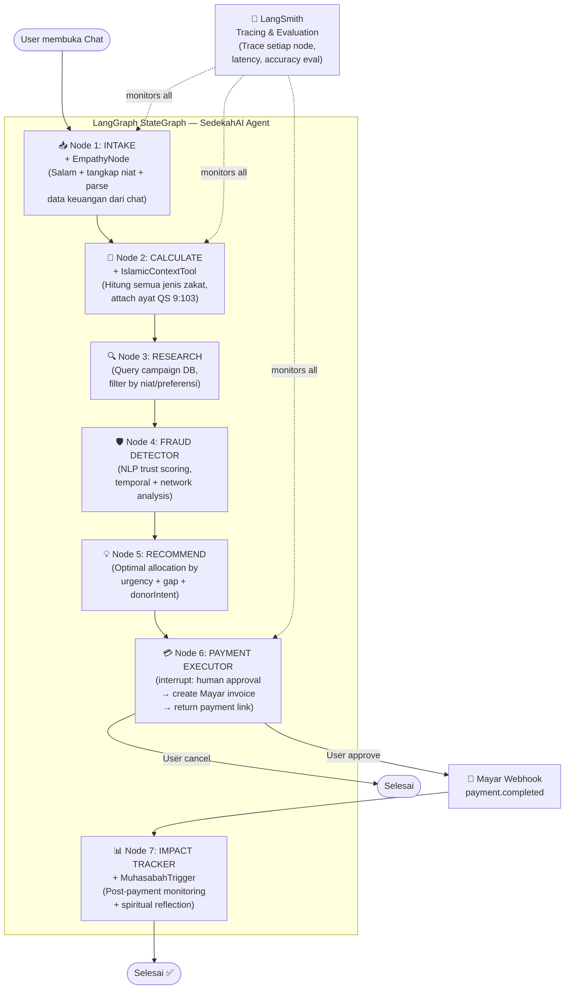
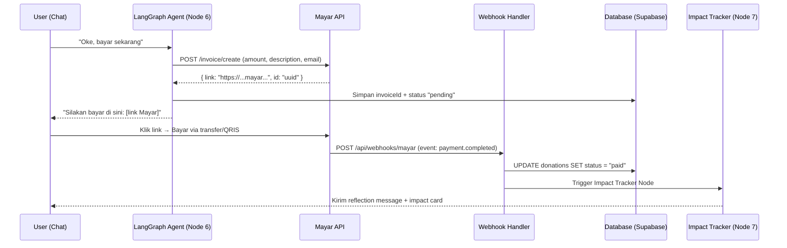
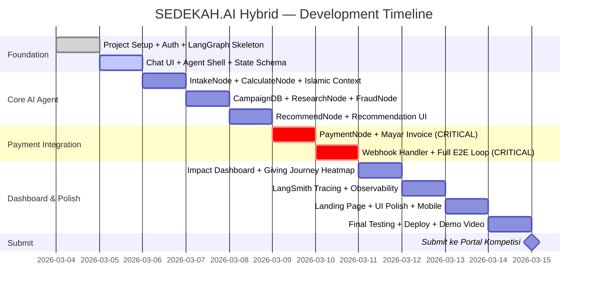

# 🕌 SEDEKAH.AI — Rancangan Pengembangan Menyeluruh

## Hybrid: SEDEKAH.AI × Ruh RUANG HATI AI

> **Dokumen Rancangan Produk & Strategi Pengembangan**
> Disusun: 5 Maret 2026 | Deadline Kompetisi: 15 Maret 2026
> Kompetisi: [Mayar Vibecoding Competition — Ramadhan 2026](https://mayar.id/vibe2026)
> Strategi: **Menang teknis (Mayar API depth) + Menang emosional (Ruh RUANG HATI AI)**

---

## 📋 Daftar Isi

1. [Visi & Konsep Hybrid](#visi--konsep-hybrid)
2. [Problem Statement](#problem-statement)
3. [Strategi Hybrid: Apa yang Diambil dari RUANG HATI AI](#strategi-hybrid)
4. [Fitur Lengkap Produk](#fitur-lengkap-produk)
5. [Arsitektur Agentic AI (LangGraph)](#arsitektur-agentic-ai)
6. [Integrasi Mayar API — Detail Lengkap](#integrasi-mayar-api)
7. [Database Schema](#database-schema)
8. [Struktur Proyek](#struktur-proyek)
9. [Timeline 10 Hari (5–14 Maret 2026)](#timeline-10-hari)
10. [Desain UI/UX](#desain-uiux)
11. [Narasi Presentasi ke Juri](#narasi-presentasi-ke-juri)
12. [Checklist Verifikasi](#checklist-verifikasi)
13. [Keputusan Strategis](#keputusan-strategis)

---

<a id="visi--konsep-hybrid"></a>

## 1. Visi & Konsep Hybrid

### Tagline Produk

> _"Setiap Rupiah Sedekah, Tepat Sasaran, Terukur Dampaknya — AI yang Menjadi Amil Digital Terpercaya, yang Memahami Bahwa Setiap Rupiah Membawa Doa"_

### Narasi Inti

> **"Di Ramadhan 2026, satu ibu di Surabaya menangis karena tidak tahu apakah donasi Rp 500.000-nya benar-benar sampai ke anak yatim yang ia pilih. Rp 297 triliun potensi zakat tidak terkumpul setiap tahun — bukan karena orang tidak mau memberi, tapi karena mereka tidak tahu cara memberi yang benar, aman, dan bermakna."**
>
> **SEDEKAH.AI hadir untuk menjawab air mata itu.**

### Konsep Hybrid

SEDEKAH.AI bukan sekadar platform pembayaran zakat. Ini adalah perpaduan dua kekuatan:

| Dimensi       | Sumber        | Implementasi                                                                             |
| ------------- | ------------- | ---------------------------------------------------------------------------------------- |
| **Teknikal**  | SEDEKAH.AI    | Mayar API depth (10 endpoints), LangGraph 6-node agent, fraud detection, impact tracking |
| **Emosional** | RUANG HATI AI | Empati Islam, ayat/hadith kontekstual, post-payment reflection, Ramadhan journey tracker |

**Hasilnya:** Produk yang menang di dua front sekaligus — juri Mayar mengangguk karena integrasi API yang dalam, dan juri lainnya tidak bisa melupakan karena cerita yang menyentuh hati.

### Winning Formula Kompetisi

```
VIBECODING DEMO + MAYAR PAYMENT INTEGRATION (DEEP) + AGENTIC AI (VISIBLE) + RAMADHAN THEME (AUTHENTIC) + WOW FACTOR (EMOTIONAL)
```

---

<a id="problem-statement"></a>

## 2. Problem Statement

### Data Masalah Utama

| #   | Masalah                    | Data                                                                     | Dampak                                                         |
| --- | -------------------------- | ------------------------------------------------------------------------ | -------------------------------------------------------------- |
| 1   | **Kompleksitas zakat**     | 73% Muslim Indonesia bingung menghitung zakat harta, emas, saham, crypto | Banyak yang underpay atau skip zakat sama sekali               |
| 2   | **Fraud kampanye amal**    | 150+ kasus penipuan donasi terungkap tahun 2025, kerugian Rp 300M+       | Erosi kepercayaan publik terhadap donasi online                |
| 3   | **Decision paralysis**     | Ratusan kampanye aktif, donatur overwhelmed memilih                      | Donasi hanya ke "kampanye viral", kebutuhan kritis terabaikan  |
| 4   | **Zero impact visibility** | 80% donatur tidak tahu dampak nyata dari donasi mereka                   | Tidak ada insentif untuk berdonasi lagi                        |
| 5   | **Fragmentasi payment**    | Tiap lembaga amil punya channel bayar berbeda                            | UX buruk, friction tinggi, abandonment rate tinggi             |
| 6   | **Kesenjangan emosional**  | Proses donasi terasa dingin dan transaksional                            | Donatur tidak merasakan koneksi spiritual dengan ibadah mereka |

### Skala Masalah

- **Potensi zakat Indonesia:** Rp 327 triliun/tahun
- **Realisasi pengumpulan BAZNAS:** ~Rp 30 triliun (9.2%)
- **Gap yang hilang:** Rp 297 triliun/tahun
- **Lonjakan donasi Ramadhan:** 10x lipat dari rata-rata bulanan
- **Lonjakan fraud Ramadhan:** Seiring lonjakan donasi

### Siapa yang Paling Menderita

| Segmen                     | Jumlah    | Kebutuhan Utama                                             |
| -------------------------- | --------- | ----------------------------------------------------------- |
| Muslim Pekerja Urban       | 45 juta+  | Bayar zakat tanpa ribet dan rasa ragu                       |
| Gen Z & Millennial Donatur | 80 juta+  | Trust, transparansi, bukti dampak nyata                     |
| Diaspora Indonesia         | 4.5 juta+ | Channel donasi ke Indonesia yang bisa dipercaya dari jauh   |
| Lembaga Amil Zakat (LAZ)   | 1.000+    | Donor acquisition, transparansi, dan kepercayaan publik     |
| CSR Perusahaan             | 50.000+   | Kalkulasi zakat akurat, distribusi teraudit, laporan dampak |

---

<a id="strategi-hybrid"></a>

## 3. Strategi Hybrid: Apa yang Diambil dari RUANG HATI AI

### Filosofi Transplant

> Ini bukan menggabungkan dua produk menjadi satu yang setengah-setengah. Ini adalah **injeksi 5 emotional layers** dari RUANG HATI AI ke dalam alur teknikal SEDEKAH.AI — tanpa mengorbankan satu pun fitur inti.

### 5 Transplant Prioritas (Terurut)

#### 🥇 Priority 1 — Berdampak Tinggi, Mudah Diimplementasi (WAJIB)

**Transplant 1: Empathy-First Intake (dari `EmpathyEngineNode`)**

| Aspek                 | Detail                                                                                                                                                                                                                                                                    |
| --------------------- | ------------------------------------------------------------------------------------------------------------------------------------------------------------------------------------------------------------------------------------------------------------------------- |
| **Dari RUANG HATI**   | Node pertama adalah Listener → Validate → Empathize SEBELUM memberikan solusi                                                                                                                                                                                             |
| **Di SEDEKAH.AI**     | AI agent tidak langsung minta data keuangan. Ia memulai dengan salam, mengakui kemuliaan niat, dan menangkap _niat_ donasi lebih dalam                                                                                                                                    |
| **Contoh Dialog**     | _"Assalamu'alaikum. Alhamdulillah, niat Anda untuk menunaikan zakat di Ramadhan ini adalah ibadah yang sangat mulia. Boleh saya tahu, apa yang paling ingin Anda wujudkan hari ini — menunaikan zakat wajib, bersedekah jariyah, atau membantu korban bencana tertentu?"_ |
| **Dampak**            | Tone produk berubah dari "kalkulator zakat" menjadi "pendamping ibadah"                                                                                                                                                                                                   |
| **Hari Implementasi** | Hari 3                                                                                                                                                                                                                                                                    |

**Transplant 2: Islamic Context Tool (dari `IslamicQuoteNode`)**

| Aspek                 | Detail                                                                                                                                                |
| --------------------- | ----------------------------------------------------------------------------------------------------------------------------------------------------- |
| **Dari RUANG HATI**   | Setiap refleksi dan sesi dibuka dengan dzikir, ayat, atau hadith kontekstual                                                                          |
| **Di SEDEKAH.AI**     | Setiap langkah agent attach ayat/hadith relevan secara otomatis                                                                                       |
| **Mapping Konteks**   | Setelah hitung zakat → QS 9:103. Setelah recommend kampanye → QS 2:261. Setelah bayar → HR Muslim tentang sedekah. Saat loading → Doa sedekah singkat |
| **Database**          | 15–20 ayat/hadith yang diindeks berdasarkan konteks (`zakat`, `sedekah`, `yatim`, `bencana`, `payment_complete`)                                      |
| **Dampak**            | Setiap interaksi terasa seperti ibadah, bukan transaksi                                                                                               |
| **Hari Implementasi** | Hari 3–4                                                                                                                                              |

#### 🥈 Priority 2 — Berdampak Tinggi, Perlu Tambahan Waktu (SANGAT DIREKOMENDASIKAN)

**Transplant 3: Post-Payment Spiritual Reflection (dari `MuhasabahTrigger`)**

| Aspek                 | Detail                                                                                                                                                                                                              |
| --------------------- | ------------------------------------------------------------------------------------------------------------------------------------------------------------------------------------------------------------------- |
| **Dari RUANG HATI**   | Setelah setiap sesi, AI memberikan refleksi singkat yang mendorong perenungan                                                                                                                                       |
| **Di SEDEKAH.AI**     | Webhook `payment.completed` dari Mayar → trigger pesan refleksi spiritual ke user di chat                                                                                                                           |
| **Contoh Pesan**      | _"Barakallah fiik. Anda baru saja meringankan beban 25 keluarga dhuafa. Setiap rupiah sedekah ini adalah amal jariyah yang terus mengalir bahkan saat Anda tertidur. Semoga Allah melipatgandakannya — [QS 2:261]"_ |
| **Dampak**            | Donatur merasakan kepuasan spiritual yang lengkap, bukan sekadar konfirmasi transaksi                                                                                                                               |
| **Hari Implementasi** | Hari 7                                                                                                                                                                                                              |

**Transplant 4: Ramadhan Giving Journey (dari 30-day tracker RUANG HATI)**

| Aspek                 | Detail                                                                                                     |
| --------------------- | ---------------------------------------------------------------------------------------------------------- |
| **Dari RUANG HATI**   | Heatmap 30 malam Ramadhan untuk melacak sesi muhasabah dan pertumbuhan emosional                           |
| **Di SEDEKAH.AI**     | Heatmap 30 hari Ramadhan menampilkan kapan user berdonasi, streak counter, milestone badges ibadah         |
| **Fitur**             | Streak "30 Hari Sedekah", badge "Khatam Zakat", AI nudge harian yang kontekstual sesuai hari ke-N Ramadhan |
| **Gamifikasi**        | Halal dan bermakna — bukan poin/XP, tapi "amal milestone" dengan makna spiritual                           |
| **Dampak**            | Retensi user selama 30 hari Ramadhan, engagement harian, koneksi emosional jangka panjang                  |
| **Hari Implementasi** | Hari 8                                                                                                     |

#### 🥉 Priority 3 — Sentuhan Final, High Differentiation (JIKA ADA WAKTU)

**Transplant 5: Muhasabah Modal Post-Donation**

| Aspek                 | Detail                                                                                                                         |
| --------------------- | ------------------------------------------------------------------------------------------------------------------------------ |
| **Dari RUANG HATI**   | Setiap sesi diakhiri dengan pertanyaan reflektif singkat yang mendorong kesadaran diri                                         |
| **Di SEDEKAH.AI**     | Optional modal 30 detik setelah payment success: satu ayat penyemangat + satu pertanyaan reflektif sederhana                   |
| **Contoh**            | _"Sejenak bersyukur... Donasi hari ini mengingatkan Anda akan siapa dalam hidup Anda yang paling ingin Anda bantu jika bisa?"_ |
| **UX**                | Bisa di-skip dengan satu klik — tidak dipaksakan                                                                               |
| **Dampak**            | Momen "wow" terakhir yang membuat produk terasa hidup dan bermakna, bukan cold checkout                                        |
| **Hari Implementasi** | Hari 11 (jika ada waktu)                                                                                                       |

### Yang TIDAK Diambil dari RUANG HATI (Scope Protection)

| Fitur                                | Alasan Tidak Diambil                                                             |
| ------------------------------------ | -------------------------------------------------------------------------------- |
| Anonymous peer rooms (Hati ke Hati)  | Membutuhkan Supabase Realtime + moderasi AI — terlalu complex untuk 10 hari solo |
| Audio dzikir library                 | Konten, bukan kode — butuh waktu kurasi, bukan development                       |
| Crisis detection & safety guardrails | Tidak relevan untuk platform donasi; menambah kompleksitas yang tidak perlu      |
| Full 30-day Muhasabah journey        | Software product tersendiri — jadikan fitur post-hackathon                       |
| Konselor marketplace                 | Digantikan perannya oleh LAZ partner page di SEDEKAH.AI                          |

---

<a id="fitur-lengkap-produk"></a>

## 4. Fitur Lengkap Produk

### 10 Fitur Utama

| #   | Nama Fitur                  | Deskripsi                                                                                                                                 |     Status MVP     |
| --- | --------------------------- | ----------------------------------------------------------------------------------------------------------------------------------------- | :----------------: |
| 1   | **Zakat Calculator AI**     | Menghitung semua jenis zakat (mal, penghasilan, emas, saham, crypto, fitrah) melalui percakapan natural — tidak ada form yang perlu diisi |       ✅ MVP       |
| 2   | **AI Campaign Verifier**    | Setiap kampanye donasi mendapat Trust Score 0–100 berdasarkan analisis NLP narasi, track record LAZ, kewajaran target, dan pola historis  |   ✅ MVP (mock)    |
| 3   | **Smart Donation Matching** | AI merekomendasikan alokasi donasi optimal berdasarkan urgency, gap funding, dan _niat_ yang ditangkap dari percakapan awal               |       ✅ MVP       |
| 4   | **Mayar Checkout Flow**     | Pembayaran melalui Mayar API — invoice otomatis dibuat oleh agent, link dikirim ke user di chat, status diperbarui real-time via webhook  |       ✅ MVP       |
| 5   | **Sedekah Autopilot**       | Sistem donasi berulang menggunakan Mayar Credit System — user set jumlah bulanan, AI agent yang eksekusi otomatis                         |    🚧 Post-MVP     |
| 6   | **Impact Dashboard**        | Visualisasi dampak per rupiah donasi: berapa orang terbantu, di kategori apa, di daerah mana                                              | ✅ MVP (simulated) |
| 7   | **Fraud Alert System**      | Notifikasi proaktif jika kampanye yang pernah didonasi menunjukkan red flag baru                                                          |    🚧 Post-MVP     |
| 8   | **Donation Portfolio**      | Rekap seluruh riwayat donasi, total zakat tersalurkan, sertifikat digital, dan laporan tax deduction                                      |    🚧 Post-MVP     |
| 9   | **Ramadhan Giving Journey** | Heatmap 30 hari Ramadhan, streak counter, milestone badges ibadah, daily AI nudge (transplant RUANG HATI)                                 |       ✅ MVP       |
| 10  | **Sedekah Autopilot**       | One-click share kampanye terverifikasi ke WhatsApp/Instagram dengan trust badge                                                           |    🚧 Post-MVP     |

### 3 Fitur Inovatif — _"Mengapa tidak ada yang memikirkan ini sebelumnya?"_

#### 🤖 Fitur Inovatif 1: Zakat Autopilot — AI Agent sebagai Amil Digital Personal

> User cukup memulai satu percakapan natural: _"Saya mau bayar zakat..."_ — dan AI agent bekerja secara **autonomous** melalui 6 tahap tanpa user perlu membuka tab lain, mengisi form, atau riset sendiri. Semua dikerjakan oleh LangGraph multi-step agent, dengan **interrupt** di satu titik penting: approval sebelum pembayaran. User hanya perlu **chat dan approve** — AI agent mengerjakan semua sisanya.
>
> Ini bukan chatbot Q&A. Ini **autonomous agent** yang benar-benar bertindak atas nama user — research, analyze, recommend, execute, dan report.

#### 🛡️ Fitur Inovatif 2: Fraud Shield AI — Deteksi Kampanye Palsu Sebelum Anda Tertipu

> AI melakukan analisis multi-dimensi terhadap setiap kampanye:
>
> - **Analisis Naratif (NLP):** Deteksi emotional manipulation berlebihan, urgency palsu, inkonsistensi cerita
> - **Analisis Temporal:** Kampanye yang muncul hanya saat Ramadhan (pola seasonal scam)
> - **Analisis Finansial:** Kewajaran target dana, rasio operasional vs penyaluran
> - **Analisis Pengelola:** Track record LAZ, verifikasi kelembagaan
>
> Output: **Trust Score 0–100** dengan breakdown TRANSPARAN mengapa skor tersebut diberikan — pertama kalinya donatur punya "credit score" untuk kampanye amal.

#### 📊 Fitur Inovatif 3: Impact Genome — ROI Amal Pertama di Dunia

> Setelah donasi tersalurkan, AI mengkonversi laporan distribusi LAZ menjadi **Impact Score** yang tangible:
>
> ```
> Donasi Anda: Rp 2.500.000
> ├── Pendidikan: Rp 1.000.000 → 5 anak yatim, buku sekolah 1 semester
> ├── Pangan: Rp 1.000.000 → 25 paket sembako untuk 25 keluarga dhuafa
> └── Kesehatan: Rp 500.000 → 3 operasi katarak lansia
>
> Impact Score: 92/100 — Top 5% donatur paling berdampak bulan ini
> ```
>
> Plus rekomendasi optimasi: _"Jika 20% dialihkan dari pangan ke pendidikan, impact score Anda naik 15% karena program pendidikan saat ini severely underfunded."_

### Transplant Fitur dari RUANG HATI AI (Ringkasan)

| Fitur Transplant            | Asal RUANG HATI           | Implementasi di SEDEKAH.AI                          |
| --------------------------- | ------------------------- | --------------------------------------------------- |
| **Empathy-First Intake**    | EmpathyEngineNode         | Salam + validasi niat sebelum kalkulasi             |
| **Islamic Context Tool**    | IslamicQuoteNode          | Ayat/hadith kontekstual di setiap agent step        |
| **Post-Payment Reflection** | MuhasabahTrigger          | Pesan spiritual setelah webhook `payment.completed` |
| **Ramadhan Giving Journey** | 30-day tracker            | Heatmap + streak + AI nudge harian                  |
| **Muhasabah Modal**         | End-of-session reflection | Optional modal 30 detik post-donation               |

---

<a id="arsitektur-agentic-ai"></a>

## 5. Arsitektur Agentic AI (LangGraph)

### Overview State Machine



### Detail Setiap Node

| Node | Nama                 | Input                                                           | Output                                           | RUANG HATI Transplant                                          |
| ---- | -------------------- | --------------------------------------------------------------- | ------------------------------------------------ | -------------------------------------------------------------- |
| 1    | **INTAKE**           | Pesan chat dari user                                            | `userFinancialData`, `donorIntent`               | ✅ Salam + validasi emosional + tangkap niat sebelum kalkulasi |
| 2    | **CALCULATE**        | `userFinancialData`                                             | `zakatBreakdown` (semua jenis), `islamicContext` | ✅ Attach `QS 9:103` setelah kalkulasi selesai                 |
| 3    | **RESEARCH**         | `donorIntent`, filter preferensi                                | `campaigns[]` (terfilter & terurut)              | —                                                              |
| 4    | **FRAUD DETECTOR**   | `campaigns[]`                                                   | `fraudScores{}` per kampanye, Trust Score 0–100  | —                                                              |
| 5    | **RECOMMEND**        | `zakatBreakdown`, `campaigns[]`, `fraudScores{}`, `donorIntent` | `recommendation` (alokasi optimal + reasoning)   | ✅ Attach hadith kontekstual per rekomendasi                   |
| 6    | **PAYMENT EXECUTOR** | `recommendation`                                                | `mayarInvoiceLink`, `invoiceId`                  | ✅ Loading state dengan animasi dzikir singkat                 |
| 7    | **IMPACT TRACKER**   | `invoiceId`, `paymentStatus = "paid"`                           | `impactReport`                                   | ✅ Post-payment spiritual reflection message                   |

### State Schema

```
SedekahState berisi:
─ messages            → riwayat percakapan lengkap
─ userFinancialData   → penghasilan, tabungan, emas, saham, crypto
─ zakatBreakdown      → zakat per jenis + total kewajiban
─ campaigns[]         → daftar kampanye aktif terfilter
─ fraudScores{}       → Trust Score per kampanye ID
─ recommendation      → alokasi optimal + reasoning AI
─ mayarInvoiceLink    → URL checkout Mayar
─ paymentStatus       → pending | paid | failed | cancelled
─ impactReport        → dampak nyata per kategori
─ donorIntent         → [RUANG HATI] niat: zakat | sedekah | bencana | yatim
─ islamicContext      → [RUANG HATI] ayat/hadith relevan untuk step saat ini
```

### Human-in-the-Loop (interrupt)

Titik satu-satunya di mana agent **berhenti dan menunggu konfirmasi user** adalah sebelum Node 6 (Payment Executor). Agent menyajikan ringkasan:

| Informasi Ditampilkan       | Deskripsi                                      |
| --------------------------- | ---------------------------------------------- |
| Ringkasan kalkulasi zakat   | Total kewajiban per jenis                      |
| Rekomendasi alokasi         | Ke kampanye mana, berapa nominal               |
| Trust Score setiap kampanye | 0–100 + reasoning singkat                      |
| Total pembayaran            | Jumlah yang akan dibayar via Mayar             |
| Tombol                      | ✅ **Bayar Sekarang** atau ✏️ **Ubah Alokasi** |

### LangSmith Tracing

| Aspek               | Konfigurasi                                                                     |
| ------------------- | ------------------------------------------------------------------------------- |
| **Project Name**    | `sedekah-ai-hybrid`                                                             |
| **Yang Di-trace**   | Setiap node (nama, input, output, latency)                                      |
| **Evaluasi**        | Akurasi kalkulasi zakat (5 test case) + kualitas framing Islam (tone evaluator) |
| **Dashboard**       | Siapkan screenshot untuk slide presentasi — bukti visual agentic AI bekerja     |
| **Penggunaan Demo** | Buka LangSmith dashboard saat presentasi dan tunjukkan trace real-time ke juri  |

---

<a id="integrasi-mayar-api"></a>

## 6. Integrasi Mayar API — Detail Lengkap

### Konfigurasi Dasar

| Parameter          | Nilai                                                           |
| ------------------ | --------------------------------------------------------------- |
| **Production URL** | `https://api.mayar.id/hl/v1`                                    |
| **Sandbox URL**    | `https://api.mayar.club/hl/v1` ← Gunakan ini selama development |
| **Auth**           | `Authorization: Bearer {MAYAR_API_KEY}`                         |
| **API Key Source** | `https://web.mayar.id/api-keys`                                 |
| **Content-Type**   | `application/json`                                              |
| **Strategy**       | Sandbox selama dev → switch ke production saat submit 15 Maret  |

### 10 Endpoints yang Digunakan (Integrasi Terdalam dari Semua Pesaing)

#### Endpoint 1: Buat Invoice Pembayaran Zakat/Sedekah

| Aspek                  | Detail                                                                                                                                                                                                                                                           |
| ---------------------- | ---------------------------------------------------------------------------------------------------------------------------------------------------------------------------------------------------------------------------------------------------------------- |
| **Endpoint**           | `POST /invoice/create`                                                                                                                                                                                                                                           |
| **Digunakan di**       | Node 6: PAYMENT EXECUTOR — ketika user approve rekomendasi                                                                                                                                                                                                       |
| **Request Fields**     | `name` (nama donatur), `email`, `mobile`, `redirectUrl` (halaman sukses), `description` (deskripsi zakat/niat), `expiredAt` (24 jam dari sekarang), `items[]` (amount + description), `extraData.noCustomer` (email), `extraData.idProd` ("sedekah-ai-donation") |
| **Response Digunakan** | `data.link` → ditampilkan di chat sebagai tombol bayar, `data.id` → disimpan di DB sebagai referensi                                                                                                                                                             |
| **Flow Setelah**       | User klik link → Mayar checkout → bayar → webhook konfirmasi                                                                                                                                                                                                     |

#### Endpoint 2: Cek Status Invoice

| Aspek                  | Detail                                                                                      |
| ---------------------- | ------------------------------------------------------------------------------------------- |
| **Endpoint**           | `GET /invoice/{id}`                                                                         |
| **Digunakan di**       | Polling dari frontend + Node 7 setelah webhook                                              |
| **Response Digunakan** | `data.status` → update tampilan di chat ("Menunggu pembayaran..." / "Pembayaran berhasil!") |

#### Endpoint 3: Buat One-Time Quick Donation Link

| Aspek                  | Detail                                                                         |
| ---------------------- | ------------------------------------------------------------------------------ |
| **Endpoint**           | `POST /payment/create`                                                         |
| **Digunakan di**       | Tombol "Donasi Cepat" di halaman kampanye (nomor bebas, tanpa kalkulasi zakat) |
| **Request Fields**     | `name`, `email`, `amount`, `mobile`, `redirectUrl`, `description`, `expiredAt` |
| **Response Digunakan** | `data.link` → external link ke Mayar checkout                                  |

#### Endpoint 4: Register Donatur Baru

| Aspek                  | Detail                                                                             |
| ---------------------- | ---------------------------------------------------------------------------------- |
| **Endpoint**           | `POST /customer/create`                                                            |
| **Digunakan di**       | Saat user pertama kali login dan profil belum ada di Mayar                         |
| **Request Fields**     | `name`, `email`, `mobile`                                                          |
| **Response Digunakan** | `data.customerId` → disimpan di tabel `users` untuk referensi transaksi berikutnya |

#### Endpoint 5: Ambil Profil & Riwayat Donatur

| Aspek                  | Detail                                         |
| ---------------------- | ---------------------------------------------- |
| **Endpoint**           | `GET /customer/{id}`                           |
| **Digunakan di**       | Halaman profil user + pre-fill form donasi     |
| **Response Digunakan** | Data lengkap customer untuk tampilan dashboard |

#### Endpoint 6: Buat Kupon Promo Ramadhan

| Aspek            | Detail                                                                      |
| ---------------- | --------------------------------------------------------------------------- |
| **Endpoint**     | `POST /discount/create`                                                     |
| **Digunakan di** | Fitur promo Ramadhan: kode `BERKAH10` untuk diskon 10% fee platform         |
| **Use Case**     | Showcase bonus fitur ke juri — bukti Mayar discount API juga diintegrasikan |

#### Endpoint 7: Ambil Semua Transaksi Sukses

| Aspek                  | Detail                                                                            |
| ---------------------- | --------------------------------------------------------------------------------- |
| **Endpoint**           | `GET /transaction/paid`                                                           |
| **Digunakan di**       | Impact Dashboard — aggregate semua donasi yang berhasil untuk visualisasi dampak  |
| **Response Digunakan** | List transaksi untuk hitung total donasi, rata-rata per user, distribusi kategori |

#### Endpoint 8: Register Webhook

| Aspek                    | Detail                                                                       |
| ------------------------ | ---------------------------------------------------------------------------- |
| **Endpoint**             | `GET /webhook/register` (dengan body)                                        |
| **Digunakan di**         | Setup awal — register URL `/api/webhooks/mayar` ke Mayar                     |
| **Request Fields**       | `urlHook` → URL endpoint webhook di Vercel kita                              |
| **Event yang Ditangani** | `payment.completed` → trigger Node 7 (Impact Tracker + Muhasabah Reflection) |

#### Endpoint 9: Tambah Kredit untuk Sedekah Autopilot

| Aspek            | Detail                                                                        |
| ---------------- | ----------------------------------------------------------------------------- |
| **Endpoint**     | `POST /creditbasedproduct/addcustomercredit`                                  |
| **Digunakan di** | Ketika user top-up saldo untuk fitur Sedekah Autopilot (donasi rutin bulanan) |
| **Use Case**     | User isi saldo Rp 500.000 → AI agent auto-deduct tiap tanggal yang dipilih    |

#### Endpoint 10: Gunakan Kredit untuk Donasi Terjadwal

| Aspek            | Detail                                                                            |
| ---------------- | --------------------------------------------------------------------------------- |
| **Endpoint**     | `POST /creditbasedproduct/spendcustomercredit`                                    |
| **Digunakan di** | Eksekusi otomatis Sedekah Autopilot pada jadwal yang ditentukan                   |
| **Use Case**     | Cron job harian memeriksa jadwal → spend kredit → buat invoice → kirim notifikasi |

### Alur Pembayaran End-to-End



---

<a id="database-schema"></a>

## 7. Database Schema

### Platform: Supabase (PostgreSQL) + Prisma ORM

### Tabel 1: `users`

| Kolom             | Tipe         | Keterangan                                                       |
| ----------------- | ------------ | ---------------------------------------------------------------- |
| `id`              | UUID (PK)    | Supabase Auth UID                                                |
| `email`           | VARCHAR(255) | Email login                                                      |
| `name`            | VARCHAR(100) | Nama lengkap                                                     |
| `mobile`          | VARCHAR(20)  | Nomor telepon                                                    |
| `mayarCustomerId` | VARCHAR(100) | ID customer di Mayar (`customer.create` response)                |
| `ramadhanStreak`  | INTEGER      | Counter streak harian donasi di Ramadhan (transplant RUANG HATI) |
| `createdAt`       | TIMESTAMP    | Waktu registrasi                                                 |
| `updatedAt`       | TIMESTAMP    | Waktu update terakhir                                            |

### Tabel 2: `donations`

| Kolom              | Tipe                  | Keterangan                                                                      |
| ------------------ | --------------------- | ------------------------------------------------------------------------------- |
| `id`               | UUID (PK)             | Internal ID                                                                     |
| `userId`           | UUID (FK → users)     | Siapa yang mendonasi                                                            |
| `amount`           | INTEGER               | Jumlah dalam Rupiah                                                             |
| `type`             | ENUM                  | `zakat_mal` / `zakat_fitrah` / `sedekah` / `infaq` / `wakaf`                    |
| `donorIntent`      | VARCHAR(100)          | Niat dari chat (transplant RUANG HATI): `yatim` / `bencana` / `kesehatan` / dll |
| `campaignId`       | UUID (FK → campaigns) | Kampanye tujuan donasi                                                          |
| `mayarInvoiceId`   | VARCHAR(100)          | ID invoice dari Mayar                                                           |
| `mayarPaymentLink` | TEXT                  | Link checkout Mayar                                                             |
| `status`           | ENUM                  | `pending` / `paid` / `failed` / `expired`                                       |
| `paidAt`           | TIMESTAMP             | Waktu konfirmasi pembayaran                                                     |
| `impactScore`      | INTEGER               | Score 0–100 dampak donasi                                                       |
| `islamicContext`   | TEXT                  | Ayat/hadith yang dilampirkan saat transaksi (transplant RUANG HATI)             |
| `reflectionSent`   | BOOLEAN               | Apakah post-payment reflection sudah dikirim (transplant RUANG HATI)            |
| `createdAt`        | TIMESTAMP             | Waktu donasi dibuat                                                             |

### Tabel 3: `campaigns`

| Kolom             | Tipe         | Keterangan                                                       |
| ----------------- | ------------ | ---------------------------------------------------------------- |
| `id`              | UUID (PK)    | Internal ID                                                      |
| `name`            | VARCHAR(200) | Nama kampanye                                                    |
| `description`     | TEXT         | Deskripsi kampanye                                               |
| `laz`             | VARCHAR(100) | Nama Lembaga Amil Zakat pengelola                                |
| `lazVerified`     | BOOLEAN      | Apakah LAZ sudah terverifikasi                                   |
| `targetAmount`    | INTEGER      | Target pengumpulan dana (Rupiah)                                 |
| `collectedAmount` | INTEGER      | Dana yang sudah terkumpul                                        |
| `trustScore`      | INTEGER      | Score 0–100 dari Fraud Shield AI                                 |
| `trustBreakdown`  | JSONB        | Detail skor per dimensi (narasi, finansial, pengelola, temporal) |
| `category`        | ENUM         | `yatim` / `bencana` / `kesehatan` / `pendidikan` / `pangan`      |
| `region`          | VARCHAR(100) | Daerah penerima manfaat                                          |
| `isActive`        | BOOLEAN      | Status aktif                                                     |
| `fraudFlags`      | INTEGER      | Jumlah flag mencurigakan                                         |
| `endsAt`          | TIMESTAMP    | Batas waktu kampanye                                             |
| `createdAt`       | TIMESTAMP    | Waktu kampanye dibuat                                            |

### Tabel 4: `fraud_flags`

| Kolom         | Tipe                  | Keterangan                                                                                  |
| ------------- | --------------------- | ------------------------------------------------------------------------------------------- |
| `id`          | UUID (PK)             | Internal ID                                                                                 |
| `campaignId`  | UUID (FK → campaigns) | Kampanye yang diflag                                                                        |
| `flagType`    | ENUM                  | `narrative_manipulation` / `financial_anomaly` / `seasonal_pattern` / `identity_unverified` |
| `description` | TEXT                  | Penjelasan flag                                                                             |
| `severity`    | ENUM                  | `low` / `medium` / `high` / `critical`                                                      |
| `detectedAt`  | TIMESTAMP             | Waktu deteksi                                                                               |

### Tabel 5: `giving_journey`

| Kolom          | Tipe              | Keterangan                                                |
| -------------- | ----------------- | --------------------------------------------------------- |
| `id`           | UUID (PK)         | Internal ID                                               |
| `userId`       | UUID (FK → users) | User pemilik journey                                      |
| `ramadhanDay`  | INTEGER           | Hari ke-N bulan Ramadhan (1–30)                           |
| `donated`      | BOOLEAN           | Apakah berdonasi di hari ini                              |
| `amount`       | INTEGER           | Total donasi hari ini (Rupiah)                            |
| `nudgeMessage` | TEXT              | Pesan AI harian yang dikirim (transplant RUANG HATI)      |
| `milestone`    | VARCHAR(100)      | Badge yang diraih: `7_hari_streak` / `khatam_zakat` / dll |
| `createdAt`    | TIMESTAMP         | Waktu record                                              |

---

<a id="struktur-proyek"></a>

## 8. Struktur Proyek

### Direktori Utama

```
sedekah-ai/
│
├── app/                              ← Next.js 14 App Router
│   ├── (auth)/
│   │   └── login/                    ← Halaman login (Supabase Auth Google + Email)
│   │
│   ├── chat/                         ← Halaman utama AI Agent chat
│   │   ├── page.tsx                  ← Chat UI dengan Vercel AI SDK streaming
│   │   └── loading.tsx               ← Loading state dengan animasi Islamic
│   │
│   ├── dashboard/                    ← Halaman Impact Dashboard
│   │   ├── page.tsx                  ← Impact cards + Ramadhan Giving Journey heatmap
│   │   └── impact/[donationId]/      ← Detail impact per donasi
│   │
│   ├── campaigns/                    ← Halaman daftar kampanye terverifikasi
│   │   ├── page.tsx
│   │   └── [id]/page.tsx             ← Detail campaign + Trust Score breakdown
│   │
│   ├── api/
│   │   ├── agent/
│   │   │   └── route.ts              ← LangGraph streaming endpoint (main agent)
│   │   └── webhooks/
│   │       └── mayar/
│   │           └── route.ts          ← Terima webhook payment.completed dari Mayar
│   │
│   ├── success/                      ← Redirect setelah pembayaran Mayar sukses
│   │   └── page.tsx                  ← Tampilkan impact card + Muhasabah modal
│   │
│   └── layout.tsx / page.tsx         ← Landing page + root layout
│
├── lib/
│   ├── agent/                        ← Seluruh LangGraph agent logic
│   │   ├── graph.ts                  ← StateGraph assembly (6 nodes + edges)
│   │   ├── state.ts                  ← SedekahState interface + schema
│   │   │
│   │   ├── nodes/                    ← 7 node files
│   │   │   ├── intake.ts             ← Node 1: Intake + EmpathyNode (RUANG HATI)
│   │   │   ├── calculate.ts          ← Node 2: Zakat calculator + Islamic context
│   │   │   ├── research.ts           ← Node 3: Campaign research & filter
│   │   │   ├── fraud.ts              ← Node 4: Fraud detection & Trust Score
│   │   │   ├── recommend.ts          ← Node 5: Optimal allocation recommendation
│   │   │   ├── payment.ts            ← Node 6: interrupt() + Mayar invoice creation
│   │   │   └── impact.ts             ← Node 7: Impact tracking + Muhasabah (RUANG HATI)
│   │   │
│   │   └── tools/                    ← LangChain @tool definitions
│   │       ├── zakat.tool.ts         ← calculate_zakat() dengan semua formula
│   │       ├── mayar.tool.ts         ← create_mayar_invoice(), check_payment_status()
│   │       ├── campaigns.tool.ts     ← search_campaigns(), get_campaign_detail()
│   │       ├── fraud.tool.ts         ← check_fraud_score(), get_trust_breakdown()
│   │       └── islamic-context.tool.ts ← get_islamic_context() [RUANG HATI transplant]
│   │
│   ├── mayar/                        ← Mayar API client layer
│   │   ├── client.ts                 ← Base HTTP client (fetch wrapper + auth)
│   │   ├── invoice.ts                ← createInvoice(), getInvoice(), closeInvoice()
│   │   ├── payment.ts                ← createPayment(), getPayment()
│   │   ├── customer.ts               ← createCustomer(), getCustomer()
│   │   ├── discount.ts               ← createCoupon(), validateCoupon()
│   │   ├── transaction.ts            ← getPaidTransactions(), getBalance()
│   │   ├── webhook.ts                ← registerWebhook(), verifyWebhook()
│   │   └── credits.ts                ← addCredit(), spendCredit(), getBalance()
│   │
│   ├── supabase/
│   │   ├── client.ts                 ← Supabase client (browser + server)
│   │   └── server.ts                 ← Server-side Supabase client (untuk API routes)
│   │
│   └── islamic-quotes/
│       └── index.ts                  ← Database 20 ayat/hadith berindeks by context [RUANG HATI]
│
├── components/
│   ├── chat/
│   │   ├── ChatInterface.tsx          ← Wrapper chat UI utama
│   │   ├── MessageBubble.tsx          ← Single message (user/AI) dengan Islamic styling
│   │   ├── AgentStepIndicator.tsx     ← Visual indicator node agent yang sedang aktif
│   │   ├── RecommendationCard.tsx     ← Kartu rekomendasi alokasi dengan Trust Score
│   │   ├── PaymentApprovalModal.tsx   ← Modal konfirmasi sebelum bayar (interrupt point)
│   │   └── IslamicQuoteBadge.tsx      ← Badge ayat/hadith kecil di bawah chat [RUANG HATI]
│   │
│   ├── dashboard/
│   │   ├── ImpactCard.tsx             ← Kartu dampak per donasi
│   │   ├── ImpactBreakdown.tsx        ← Breakdown detail per kategori
│   │   ├── GivingJourneyHeatmap.tsx   ← Heatmap 30 hari Ramadhan [RUANG HATI transplant]
│   │   ├── StreakCounter.tsx          ← Streak counter + badge [RUANG HATI transplant]
│   │   └── DonationHistory.tsx        ← Tabel riwayat donasi
│   │
│   ├── campaigns/
│   │   ├── CampaignCard.tsx           ← Kartu kampanye dengan Trust Score badge
│   │   ├── TrustScoreBar.tsx          ← Visual bar Trust Score 0–100
│   │   └── FraudFlagWarning.tsx       ← Warning banner jika Trust Score < 40
│   │
│   └── shared/
│       ├── IslamicLoadingSpinner.tsx  ← Loading dengan animasi arabesque [RUANG HATI]
│       ├── MuhasabahModal.tsx         ← Optional post-donation reflection [RUANG HATI]
│       ├── PostPaymentReflection.tsx  ← Pesan spiritual post-payment [RUANG HATI]
│       ├── RamadhanDayBadge.tsx       ← Badge hari ke-N Ramadhan
│       └── SurahAyatDisplay.tsx       ← Display ayat Al-Quran dengan styling Arab
│
├── prisma/
│   ├── schema.prisma                  ← 5 tabel: users, donations, campaigns, fraud_flags, giving_journey
│   └── seed.ts                        ← 20 sample campaigns dengan Trust Score
│
├── public/
│   ├── images/
│   │   ├── hero-sedekah.jpg           ← Gambar hero section (ibu berdoa)
│   │   └── ramadhan-pattern.svg       ← Islamic geometric pattern background
│   └── icons/                         ← App icons
│
└── .env.local                         ← Semua environment variables
```

### Environment Variables

| Variable                        | Source                                   | Keterangan                            |
| ------------------------------- | ---------------------------------------- | ------------------------------------- |
| `OPENAI_API_KEY`                | platform.openai.com                      | LLM untuk semua agent nodes           |
| `LANGCHAIN_API_KEY`             | smith.langchain.com                      | LangSmith tracing                     |
| `LANGCHAIN_TRACING_V2`          | `true` (fixed value)                     | Aktifkan tracing                      |
| `LANGCHAIN_PROJECT`             | `sedekah-ai-hybrid` (fixed value)        | Nama project di LangSmith             |
| `MAYAR_API_KEY`                 | web.mayar.id/api-keys                    | Autentikasi semua Mayar API call      |
| `MAYAR_BASE_URL`                | `https://api.mayar.club/hl/v1` (sandbox) | Switch ke production saat submit      |
| `NEXT_PUBLIC_SUPABASE_URL`      | supabase.com                             | Supabase project URL                  |
| `NEXT_PUBLIC_SUPABASE_ANON_KEY` | supabase.com                             | Supabase anon key untuk browser       |
| `SUPABASE_SERVICE_ROLE_KEY`     | supabase.com                             | Supabase service key untuk API routes |
| `NEXT_PUBLIC_APP_URL`           | `http://localhost:3000` (dev)            | URL untuk Mayar redirect + webhook    |

---

<a id="timeline-10-hari"></a>

## 9. Timeline 10 Hari (5–14 Maret 2026)

> **Hari ini: 5 Maret (Hari 2).** 10 hari tersisa. Target selesai: **14 Maret malam** (bukan 15 Maret sore).

### Overview Timeline



### Detail Per Hari

---

#### 🟡 Hari 2 — 5 Maret 2026 (HARI INI)

**Fokus:** Chat UI + Auth + LangGraph Skeleton

| Task                                       | Detail                                                                                        | Estimasi       |
| ------------------------------------------ | --------------------------------------------------------------------------------------------- | -------------- |
| Setup Next.js 14 App Router + dependencies | `npx create-next-app@latest`, install semua packages                                          | 1 jam          |
| Supabase Auth (Google + Email)             | Login/logout, session management, middleware proteksi route                                   | 2 jam          |
| LangGraph `StateGraph` skeleton            | 6 node kosong (placeholder), state schema dengan `donorIntent` + `islamicContext` sudah ada   | 2 jam          |
| Chat UI dasar                              | Komponen `ChatInterface`, `MessageBubble`, input box, streaming response dengan Vercel AI SDK | 3 jam          |
| Deploy ke Vercel (development)             | Auto-deploy dari GitHub, konfirmasi CI/CD berjalan                                            | 30 menit       |
| **RUANG HATI transplant hari ini**         | Tambah `donorIntent` dan `islamicContext` ke state schema SEKARANG — fondasi emotional layer  | Sudah di-scope |

**DoD (Definition of Done):** User bisa login, melihat halaman chat kosong, dan terhubung ke LangGraph agent endpoint (walaupun response masih placeholder).

---

#### 🟡 Hari 3 — 6 Maret 2026

**Fokus:** IntakeNode + CalculateNode + Islamic Context Tool

| Task                                                | Detail                                                                                   | Estimasi |
| --------------------------------------------------- | ---------------------------------------------------------------------------------------- | -------- |
| `IntakeNode` lengkap                                | Parse data keuangan (penghasilan, tabungan, emas, saham, crypto) dari chat natural       | 3 jam    |
| **EmpathyNode (transplant RUANG HATI)**             | Salam Islam + validasi emosional + tangkap `donorIntent` sebelum kalkulasi               | 2 jam    |
| `CalculateNode` lengkap                             | Formula semua 6 jenis zakat dengan nisab 2026 (Rp 8.5 juta = 85 gram emas × harga emas)  | 3 jam    |
| **`getIslamicContextTool` (transplant RUANG HATI)** | Database 15 ayat/hadith berindeks (`zakat`, `sedekah`, `yatim`, `payment_complete`, dll) | 1.5 jam  |
| Test kalkulasi                                      | 5 skenario: hanya penghasilan / hanya emas / kombinasi semua / di bawah nisab / crypto   | 1 jam    |

**DoD:** User bisa chat _"Saya mau bayar zakat, penghasilan 15 juta, emas 50 gram"_ → AI menjawab dengan salam, menanyakan niat, menghitung semua jenis zakat, dan menampilkan ayat QS 9:103.

---

#### 🟡 Hari 4 — 7 Maret 2026

**Fokus:** Campaign Database + ResearchNode + FraudNode

| Task                               | Detail                                                                                                   | Estimasi |
| ---------------------------------- | -------------------------------------------------------------------------------------------------------- | -------- |
| Prisma schema + migration          | Buat 5 tabel, jalankan `prisma migrate dev`                                                              | 1.5 jam  |
| Seed 20 kampanye sample            | Data representatif: 4 kategori, berbagai daerah, berbagai LAZ, Trust Score bervariasi                    | 2 jam    |
| `ResearchNode` lengkap             | Query campaigns berdasarkan `donorIntent`, filter aktif, urut berdasarkan urgency + gap                  | 2.5 jam  |
| `FraudDetectorNode` lengkap        | Rule-based Trust Score: poin dari kelengkapan info + LAZ verified + rasio pengumpulan + kewajaran target | 2.5 jam  |
| **Islamic context di rekomendasi** | Setiap kampanye yang direkomendasikan mendapat hadith kontekstual sesuai kategori                        | 1 jam    |

**DoD:** Agent bisa menampilkan 3–5 rekomendasi kampanye dengan Trust Score, badge LAZ verified, hadith relevan, dan penjelasan reasoning.

---

#### 🟡 Hari 5 — 8 Maret 2026

**Fokus:** RecommendNode + Recommendation UI

| Task                             | Detail                                                                                                  | Estimasi |
| -------------------------------- | ------------------------------------------------------------------------------------------------------- | -------- |
| `RecommendNode` lengkap          | Algoritma alokasi optimal: weight berdasarkan urgency (40%), gap funding (30%), donorIntent match (30%) | 3 jam    |
| `RecommendationCard` component   | Kartu alokasi yang menampilkan: kampanye, nominal, Trust Score, kategori, hadith                        | 2 jam    |
| `TrustScoreBar` component        | Visual bar 0–100 dengan color coding: hijau (>70) / kuning (40–70) / merah (<40)                        | 1 jam    |
| `FraudFlagWarning` component     | Banner warning jika Trust Score < 40 dengan penjelasan terdetail                                        | 1 jam    |
| `PaymentApprovalModal` component | Modal konfirmasi total bayar sebelum pembayaran — interrupt point                                       | 2 jam    |

**DoD:** Setelah kalkulasi dan research, agent menampilkan rekomendasi alokasi yang bisa user review, adjust, lalu approve — sebelum lanjut ke payment.

---

#### 🔴 Hari 6 — 9 Maret 2026 (HARI KRITIS #1)

**Fokus:** PaymentNode + Mayar Invoice Integration

| Task                               | Detail                                                                                | Estimasi |
| ---------------------------------- | ------------------------------------------------------------------------------------- | -------- |
| Mayar API client layer             | `lib/mayar/client.ts` + `invoice.ts` + `customer.ts`                                  | 2 jam    |
| `createMayarInvoiceTool`           | Tool yang memanggil `POST /invoice/create` di sandbox Mayar                           | 2 jam    |
| `PaymentNode` dengan `interrupt()` | Human-in-the-loop: tampilkan ringkasan → tunggu approval → buat invoice → kirim link  | 2 jam    |
| **IslamicLoadingSpinner**          | Animasi loading dengan arabesque pattern saat invoice dibuat (transplant RUANG HATI)  | 1 jam    |
| End-to-end test Hari 6             | Chat → kalkulasi → rekomendasi → approve → invoice dibuat → link Mayar muncul di chat | 2 jam    |

**DoD (WAJIB):** Invoice berhasil dibuat di sandbox Mayar. Link checkout Mayar muncul di chat. Ini adalah critical gate — tanpa ini semua kerja teknikal tidak terbuktikan ke juri.

---

#### 🔴 Hari 7 — 10 Maret 2026 (HARI KRITIS #2)

**Fokus:** Webhook Handler + Full Payment E2E Loop

| Task                                                          | Detail                                                                                | Estimasi |
| ------------------------------------------------------------- | ------------------------------------------------------------------------------------- | -------- |
| `/api/webhooks/mayar/route.ts`                                | Handler yang menerima `payment.completed`, update DB, trigger Impact Tracker          | 3 jam    |
| Mayar webhook registration                                    | Daftarkan URL webhook ke Mayar via `GET /webhook/register`                            | 30 menit |
| Webhook testing                                               | Test dengan Mayar sandbox webhook trigger → konfirmasi DB update                      | 1.5 jam  |
| **`PostPaymentReflection` component** (transplant RUANG HATI) | Pesan spiritual setelah webhook diterima — muncul di chat secara otomatis             | 1.5 jam  |
| `ImpactTrackerNode` dasar                                     | Simpan data impact (simulated) setelah payment confirmed                              | 1.5 jam  |
| Full E2E test Hari 7                                          | Chat → kalkulasi → approve → invoice → bayar (simulate) → webhook → reflection muncul | 1 jam    |

**DoD (WAJIB):** Full loop terbukti: AI agent membuat invoice Mayar → user "bayar" → webhook diterima → `PostPaymentReflection` dikirim ke user di chat. **Ini adalah demo inti yang akan ditunjukkan ke juri.**

---

#### 🟡 Hari 8 — 11 Maret 2026

**Fokus:** Impact Dashboard + Ramadhan Giving Journey

| Task                                                         | Detail                                                                              | Estimasi |
| ------------------------------------------------------------ | ----------------------------------------------------------------------------------- | -------- |
| Impact Dashboard halaman                                     | Query `donations` tabel → aggregate per kategori → tampilkan kartu impact           | 3 jam    |
| `ImpactCard` + `ImpactBreakdown` components                  | Visual yang menarik: "Donasi Anda = 5 anak yatim + 25 keluarga + 3 operasi katarak" | 2 jam    |
| **`GivingJourneyHeatmap` component** (transplant RUANG HATI) | Heatmap 30 hari Ramadhan (ala GitHub contribution graph), warna per hari donasi     | 2 jam    |
| **`StreakCounter` component** (transplant RUANG HATI)        | Counter streak + badge milestone: "7 Hari Berturut-turut 🔥"                        | 1 jam    |
| Daily AI nudge system                                        | Pesan AI harian berdasarkan `ramadhanDay` dan apakah user sudah donasi hari ini     | 1 jam    |

**DoD:** Dashboard menampilkan impact cards, heatmap 30 hari, streak counter, dan daily nudge — semua terhubung ke data Supabase.

---

#### 🟡 Hari 9 — 12 Maret 2026

**Fokus:** LangSmith Tracing + Observability

| Task                             | Detail                                                                                           | Estimasi |
| -------------------------------- | ------------------------------------------------------------------------------------------------ | -------- |
| Konfigurasi LangSmith penuh      | Set env vars, konfirmasi project `sedekah-ai-hybrid` muncul di dashboard                         | 1 jam    |
| Verifikasi semua node ter-trace  | Jalankan agent manual → konfirmasi semua 7 node muncul di LangSmith dengan input/output          | 2 jam    |
| Buat evaluation dataset          | 5 test case kalkulasi zakat + 3 test case tone emosional → upload ke LangSmith sebagai evaluator | 2 jam    |
| Screenshot LangSmith untuk slide | Ambil screenshot tampilan trace yang paling impressive untuk slide presentasi                    | 30 menit |
| Performance check                | Ukur latency per node — optimasi jika ada yang > 5 detik                                         | 1.5 jam  |

**DoD:** LangSmith dashboard menampilkan traces lengkap dengan semua 7 node, input/output per node, dan latency metrics. Screenshot siap untuk presentasi.

---

#### 🟡 Hari 10 — 13 Maret 2026

**Fokus:** Landing Page + UI Polish + Mobile Responsive

| Task                                                      | Detail                                                                                    | Estimasi |
| --------------------------------------------------------- | ----------------------------------------------------------------------------------------- | -------- |
| Landing page lengkap                                      | Hero (narasi ibu Surabaya), problem statement, 3 fitur utama, CTA, footer                 | 3 jam    |
| UI polish chat interface                                  | Konsistensi warna, spacing, tipografi, hover states, loading states                       | 2 jam    |
| Mobile responsive (375px–768px)                           | Test dan perbaiki layout di iPhone SE, iPhone 15, iPad                                    | 2 jam    |
| Edge case handling                                        | Zakat di bawah nisab, kampanye semua Trust Score rendah, network error, Mayar API timeout | 1.5 jam  |
| **`MuhasabahModal` component** (transplant RUANG HATI P3) | Optional post-donation reflection modal 30 detik — jika ada waktu                         | 1 jam    |

**DoD:** Landing page polished dan informatif. Chat interface berfungsi sempurna di mobile. Edge cases ditangani dengan pesan error yang baik.

---

#### 🟡 Hari 11 — 14 Maret 2026

**Fokus:** Final Testing + Deploy Production + Demo Video

| Task                          | Detail                                                                                                         | Estimasi |
| ----------------------------- | -------------------------------------------------------------------------------------------------------------- | -------- |
| Full E2E test — 5 happy paths | Zakat only / Sedekah only / Keduanya / Sedekah bencana intent / Quick donation                                 | 2 jam    |
| Switch Mayar ke production    | Ganti `MAYAR_BASE_URL` ke `https://api.mayar.id/hl/v1`, test ulang                                             | 1 jam    |
| Deploy ke Vercel production   | Push to main → auto-deploy → konfirmasi semua env vars di Vercel dashboard                                     | 1 jam    |
| Record demo video (3–5 menit) | Screen record: landing → login → chat agent → kalkulasi → rekomendasi → bayar Mayar → impact → LangSmith trace | 2 jam    |
| Persiapkan dokumentasi submit | README dengan: arsitektur, LangSmith screenshots, list Mayar endpoints, setup guide                            | 1 jam    |

**DoD (FINAL):** Aplikasi live di Vercel production. Demo video ready. README lengkap. Semua siap untuk submit 15 Maret pagi.

---

### Buffer Strategy

| Skenario                                   | Mitigasi                                                                         |
| ------------------------------------------ | -------------------------------------------------------------------------------- |
| Mayar API sandbox bermasalah (Hari 6)      | Mock invoice response dengan hardcoded link yang terlihat real — tetap demo-able |
| LangGraph agent terlalu lambat (>10 detik) | Reduce node ke 4 (gabung Research+Fraud, gabung Recommend+Payment)               |
| Supabase connection issues                 | Fallback ke in-memory data untuk demo hari 6–7                                   |
| Hari 8 kehabisan waktu                     | Heatmap bisa diganti tabel sederhana — fungsi tetap ada                          |
| Tidak sempat Muhasabah Modal (P3)          | Ini opsional — skip aman, 4 transplant P1+P2 sudah cukup                         |

---

<a id="desain-uiux"></a>

## 10. Desain UI/UX, Branding & Logo

---

### 10.1 Logo SEDEKAH.AI

#### Konsep Logo

Logo SEDEKAH.AI harus mengkomunikasikan tiga hal sekaligus dalam satu simbol:

1. **Spiritualitas Islam** — identitas dan kepercayaan
2. **Teknologi AI** — kecerdasan, modernitas, kepercayaan digital
3. **Kebaikan yang Mengalir** — pergerakan, dampak, kehangatan

#### Elemen Visual Logo

| Elemen                              | Simbol                                                                         | Makna                                                     |
| ----------------------------------- | ------------------------------------------------------------------------------ | --------------------------------------------------------- |
| **Bentuk Utama**                    | Tangan terbuka (memberi) yang terbentuk dari garis-garis sirkuit digital       | Perpaduan kebaikan manusia (sedekah) dengan kecerdasan AI |
| **Inner Symbol**                    | Bulan sabit dan bintang minimalis di dalam/di atas tangan                      | Identitas Islam yang kuat tapi tidak dogmatis             |
| **Partikel**                        | Titik-titik kecil bergerak ke atas dari tangan, membentuk arabesque minimal    | Donasi yang "mengalir" dan memberi dampak (amal jariyah)  |
| **Wordmark**                        | "SEDEKAH.AI" — huruf kapital tebal dengan titik (.) berwarna gold sebelum "AI" | Memisahkan kata sedekah dan AI, tapi menyatukannya        |
| **Tagline** (opsional di logo full) | "Setiap Rupiah, Terarah & Bermakna"                                            | Ringkasan value proposition                               |

#### Variasi Logo

| Variasi           | Penggunaan                    | Deskripsi                                   |
| ----------------- | ----------------------------- | ------------------------------------------- |
| **Logo Penuh**    | Landing page hero, presentasi | Icon + wordmark horizontal, dengan tagline  |
| **Logo Stacked**  | Footer, about page            | Icon di atas wordmark vertikal              |
| **Icon Only**     | Favicon, app icon, avatar     | Hanya simbol tangan+bulan sabit, tanpa teks |
| **Wordmark Only** | Header navbar (dark bg)       | Hanya teks "SEDEKAH.AI" bergaya             |
| **Dark Version**  | Di atas background gelap      | Icon + wordmark berwarna cream/gold         |
| **Light Version** | Di atas background terang     | Icon + wordmark berwarna deep green/gold    |
| **Monochrome**    | Dokumen resmi, hitam putih    | Satu warna saja (hitam atau putih)          |

---

### 10.2 Color Palette — Riset & Definisi Lengkap

#### Filosofi Warna

> Warna SEDEKAH.AI dirancang berdasarkan tiga prinsip: **Kepercayaan** (warna yang membuat orang percaya untuk menyerahkan uang mereka), **Spiritualitas** (warna yang mengingatkan ibadah dan ketenangan), dan **Kehangatan** (warna yang membuat donasi terasa seperti perbuatan baik, bukan transaksi dingin).

#### Referensi Psikologi Warna

| Warna               | Psikologi                                              | Mengapa Tepat untuk SEDEKAH.AI                                                            |
| ------------------- | ------------------------------------------------------ | ----------------------------------------------------------------------------------------- |
| **Hijau**           | Kepercayaan, pertumbuhan, alam, kesehatan, uang, Islam | Warna yang paling identik dengan Islam; warna kepercayaan finansial; warna harapan        |
| **Emas/Gold**       | Kemewahan, nilai, kebijaksanaan, pencapaian spiritual  | Zakat dan sedekah adalah "investasi akhirat" — gold mewakili nilai tak ternilai dari amal |
| **Krem/Warm White** | Kebersihan, ketenangan, ruang bernapas, kesucian       | Membuat produk terasa bersih dan niat suci, tidak overcrowded                             |
| **Hitam Kebiruan**  | Profesionalitas, ketegasan, teknologi                  | Untuk teks — memberikan kesan fintech profesional, bukan amatir                           |

---

#### Color Palette Lengkap

##### 🎨 Primary Colors (Warna Utama Brand)

| Nama              | Hex       | RGB                | Penggunaan                                                         |
| ----------------- | --------- | ------------------ | ------------------------------------------------------------------ |
| **Emerald Deep**  | `#1B4332` | rgb(27, 67, 50)    | Warna brand utama — navbar, tombol primer, header, logo background |
| **Emerald Mid**   | `#2D6A4F` | rgb(45, 106, 79)   | Hover state tombol primer, card header, section dividers           |
| **Emerald Light** | `#40916C` | rgb(64, 145, 108)  | Border aksen, icon fills, secondary buttons                        |
| **Emerald Pale**  | `#74C69D` | rgb(116, 198, 157) | Tag/badge fill, progress bar fill (sedang), subtle highlights      |
| **Emerald Ghost** | `#D8F3DC` | rgb(216, 243, 220) | Background card hijau, success notification bg, hover bg           |

##### ✨ Gold/Accent Colors

| Nama            | Hex       | RGB                | Penggunaan                                                   |
| --------------- | --------- | ------------------ | ------------------------------------------------------------ |
| **Gold Deep**   | `#92620A` | rgb(146, 98, 10)   | Teks gold di background terang (keterbacaan tinggi)          |
| **Gold Core**   | `#C9A227` | rgb(201, 162, 39)  | Aksen utama — icon star, badge border, logo dot, heatmap max |
| **Gold Bright** | `#E8C55A` | rgb(232, 197, 90)  | Hover state gold, milestone badge fill                       |
| **Gold Pale**   | `#FDF3C4` | rgb(253, 243, 196) | Background gold-tinted card, highlight row, streak badge bg  |
| **Gold Ghost**  | `#FFFBEB` | rgb(255, 251, 235) | Section background warm, Ramadhan journey bg                 |

##### 🏜️ Neutral / Foundation Colors

| Nama              | Hex       | RGB                | Penggunaan                                              |
| ----------------- | --------- | ------------------ | ------------------------------------------------------- |
| **Ink Black**     | `#0F1923` | rgb(15, 25, 35)    | Teks utama headings (h1, h2)                            |
| **Ink Dark**      | `#1E293B` | rgb(30, 41, 59)    | Teks body paragraf                                      |
| **Ink Mid**       | `#475569` | rgb(71, 85, 105)   | Teks secondary, subtitle, caption                       |
| **Ink Light**     | `#94A3B8` | rgb(148, 163, 184) | Placeholder, disabled state, hint text                  |
| **Ink Ghost**     | `#CBD5E1` | rgb(203, 213, 225) | Border default, divider lines, input border             |
| **Surface White** | `#FFFFFF` | rgb(255, 255, 255) | Background card, dialog, popover                        |
| **Surface Warm**  | `#FAF3E0` | rgb(250, 243, 224) | Background halaman utama (warm cream, bukan cold white) |
| **Surface Cool**  | `#F8FAFC` | rgb(248, 250, 252) | Background alternatif (halaman campaign list)           |

##### ✅ Semantic Colors

| Nama              | Hex       | Penggunaan                                                       |
| ----------------- | --------- | ---------------------------------------------------------------- |
| **Success**       | `#16A34A` | Payment berhasil, webhook confirmed, status "paid", streak aktif |
| **Success Light** | `#DCFCE7` | Background notifikasi sukses, success toast bg                   |
| **Warning**       | `#D97706` | Trust Score medium (40–70), peringatan ringan, expiring invoice  |
| **Warning Light** | `#FEF9C3` | Background warning toast                                         |
| **Danger**        | `#DC2626` | Trust Score rendah (<40), fraud alert, payment failed            |
| **Danger Light**  | `#FEE2E2` | Background error/fraud warning                                   |
| **Info**          | `#0284C7` | Info tooltip, panduan user, "tahukah Anda"                       |
| **Info Light**    | `#E0F2FE` | Background info card                                             |

##### 🛡️ Trust Score Color Mapping

| Range Score  | Status            | Warna Hex               | Label                        |
| ------------ | ----------------- | ----------------------- | ---------------------------- |
| **85 – 100** | Sangat Terpercaya | `#16A34A` (hijau solid) | ✅ Verified & Trusted        |
| **70 – 84**  | Terpercaya        | `#4ADE80` (hijau muda)  | ✅ Good Standing             |
| **55 – 69**  | Cukup Baik        | `#EAB308` (kuning)      | ⚠️ Verify Before Giving      |
| **40 – 54**  | Perlu Perhatian   | `#F97316` (oranye)      | ⚠️ Use Caution               |
| **0 – 39**   | Berisiko Tinggi   | `#DC2626` (merah)       | 🚨 High Risk — Do Not Donate |

##### 🌙 Ramadhan Giving Journey Heatmap Colors

| Intensitas          | Kondisi                   | Warna Hex                    |
| ------------------- | ------------------------- | ---------------------------- |
| **Kosong**          | Belum ada donasi hari itu | `#E8F5E9` (ghost green)      |
| **Level 1**         | Donasi < Rp 50.000        | `#74C69D`                    |
| **Level 2**         | Donasi Rp 50K – 200K      | `#40916C`                    |
| **Level 3**         | Donasi Rp 200K – 500K     | `#2D6A4F`                    |
| **Level 4 (Penuh)** | Donasi > Rp 500.000       | `#1B4332` + gold glow border |

---

#### Penggunaan Warna per Komponen

| Komponen                   | Background                        | Text      | Border/Accent                     |
| -------------------------- | --------------------------------- | --------- | --------------------------------- |
| **Navbar**                 | `#1B4332`                         | `#FAF3E0` | `#C9A227` (gold underline active) |
| **Hero Section**           | `#1B4332` (gradient ke `#2D6A4F`) | `#FAF3E0` | `#C9A227` CTA button              |
| **Chat bubble — User**     | `#1B4332`                         | `#FFFFFF` | —                                 |
| **Chat bubble — AI**       | `#FFFFFF`                         | `#1E293B` | `#D8F3DC` left border             |
| **IslamicQuoteBadge**      | `#FDF3C4`                         | `#92620A` | `1px solid #C9A227`               |
| **Campaign Card**          | `#FFFFFF`                         | `#1E293B` | `#CBD5E1`                         |
| **Trust Score High**       | `#DCFCE7`                         | `#16A34A` | `#16A34A`                         |
| **Trust Score Low**        | `#FEE2E2`                         | `#DC2626` | `#DC2626`                         |
| **Payment Approval Modal** | `#FFFFFF`                         | `#0F1923` | `#1B4332` header bg               |
| **CTA Button (bayar)**     | `#C9A227`                         | `#0F1923` | — (no border)                     |
| **Secondary Button**       | `transparent`                     | `#1B4332` | `2px solid #1B4332`               |
| **Impact Card**            | gradient `#D8F3DC → #FFFFFF`      | `#1E293B` | `#40916C` left border 4px         |
| **Streak Badge**           | `#FDF3C4`                         | `#92620A` | `#C9A227`                         |
| **Footer**                 | `#0F1923`                         | `#94A3B8` | `#1B4332` top border              |

---

#### Gradients

| Nama                    | CSS Value                                                             | Penggunaan                               |
| ----------------------- | --------------------------------------------------------------------- | ---------------------------------------- |
| **Hero Gradient**       | `linear-gradient(135deg, #1B4332 0%, #2D6A4F 50%, #40916C 100%)`      | Landing page hero background             |
| **Gold Shimmer**        | `linear-gradient(90deg, #92620A, #C9A227, #E8C55A, #C9A227, #92620A)` | Animasi loading gold (sedekah autopilot) |
| **Impact Gradient**     | `linear-gradient(180deg, #D8F3DC 0%, #FFFFFF 100%)`                   | Impact card background                   |
| **Warm Fade**           | `linear-gradient(180deg, #FAF3E0 0%, #FFFFFF 100%)`                   | Page section transition                  |
| **Trust High Gradient** | `linear-gradient(90deg, #16A34A, #4ADE80)`                            | Trust score bar (high)                   |
| **Trust Low Gradient**  | `linear-gradient(90deg, #DC2626, #F97316)`                            | Trust score bar (low)                    |

---

#### Dark Mode (Opsional — Post-Hackathon)

| Token              | Light Mode | Dark Mode |
| ------------------ | ---------- | --------- |
| `--bg-primary`     | `#FAF3E0`  | `#0F1923` |
| `--bg-card`        | `#FFFFFF`  | `#1E293B` |
| `--text-primary`   | `#0F1923`  | `#FAF3E0` |
| `--text-secondary` | `#475569`  | `#94A3B8` |
| `--brand-green`    | `#1B4332`  | `#40916C` |
| `--brand-gold`     | `#C9A227`  | `#E8C55A` |

---

#### Implementasi di Tailwind CSS

Tambahkan ke `tailwind.config.ts`:

```
theme.extend.colors = {
  brand: {
    green: {
      deep:  '#1B4332',  // bg primer
      mid:   '#2D6A4F',  // hover
      light: '#40916C',  // border aksen
      pale:  '#74C69D',  // badge fill
      ghost: '#D8F3DC',  // card bg
    },
    gold: {
      deep:   '#92620A',  // teks gold
      core:   '#C9A227',  // aksen utama
      bright: '#E8C55A',  // hover
      pale:   '#FDF3C4',  // badge bg
      ghost:  '#FFFBEB',  // section bg
    },
  },
  surface: {
    warm:  '#FAF3E0',
    cool:  '#F8FAFC',
    white: '#FFFFFF',
  },
  ink: {
    black: '#0F1923',
    dark:  '#1E293B',
    mid:   '#475569',
    light: '#94A3B8',
    ghost: '#CBD5E1',
  },
}
```

---

### 10.3 Tipografi

| Penggunaan                 | Font                  | Weight              | Keterangan                                                |
| -------------------------- | --------------------- | ------------------- | --------------------------------------------------------- |
| **Heading H1, H2**         | **Plus Jakarta Sans** | 700–800 (ExtraBold) | Modern, tegas, lebih karakterful dari Geist untuk heading |
| **Heading H3, H4**         | **Plus Jakarta Sans** | 600 (SemiBold)      | Konsisten dengan heading                                  |
| **Body Text**              | **Inter**             | 400–500             | Highly legible di semua ukuran, industri standar          |
| **Caption & Label kecil**  | **Inter**             | 400                 | Konsisten                                                 |
| **Angka nominal donasi**   | **Plus Jakarta Sans** | 700                 | Tabular figures — angka besar harus impactful             |
| **Ayat Al-Quran**          | **Amiri**             | 400                 | Khusus Arabic script, beautiful rendering                 |
| **Hadith/terjemahan**      | **Inter Italic**      | 400 italic          | Membedakan quote dari body text                           |
| **Code/teknis** (internal) | **Geist Mono**        | 400                 | Hanya untuk developer-facing content                      |

**Google Fonts Import Priority:**

1. `Plus Jakarta Sans` (wajib — heading)
2. `Inter` (wajib — body)
3. `Amiri` (wajib — ayat Al-Quran)

---

### 10.4 Komponen Desain Khas (Pembeda Visual)

| Komponen                     | Deskripsi                                                                                                             |
| ---------------------------- | --------------------------------------------------------------------------------------------------------------------- |
| **Islamic Geometric Border** | Pola girih (bintang 8 titik) sebagai SVG dekorasi di card title dan section header — stroke `#C9A227`, opacity 20–30% |
| **Bulan-Bintang Watermark**  | SVG bulan sabit + bintang di background chat, warna `#1B4332` opacity 5% — sublime, tidak mengganggu                  |
| **IslamicLoadingSpinner**    | Arabesque 8-titik yang berputar, warna gradient green-to-gold — pengganti spinner generic                             |
| **IslamicQuoteBadge**        | Badge `#FDF3C4` dengan border `#C9A227`, teks Arabic script + terjemahan italic — muncul di bawah pesan AI penting    |
| **Trust Score Ring**         | Circular progress ring (bukan bar), warna gradient sesuai skor — lebih premium dari bar biasa                         |
| **Giving Journey Heatmap**   | Grid 7×5 (30 hari + padding), intensitas warna sesuai amount, hover menampilkan tooltip detail                        |
| **Streak Flame Badge**       | Icon api dengan angka streak di tengah, warna `#C9A227` — muncul di navbar saat streak aktif                          |
| **Impact Number Counter**    | Animated number counter saat impact card pertama kali muncul — "0 → 25 keluarga" animasi 1.5 detik                    |

---

### 10.5 Tone of Voice AI

| Aspek                 | Panduan                                                                                 |
| --------------------- | --------------------------------------------------------------------------------------- |
| **Pembukaan selalu**  | _"Assalamu'alaikum"_ atau _"Bismillahirrahmanirrahim"_                                  |
| **Konfirmasi niat**   | _"Alhamdulillah, niat Anda untuk..."_ — validasi emosional sebelum kalkulasi            |
| **Kalkulasi**         | Jelas, tepat, format Rupiah dengan titik ribuan (Rp 6.250.000)                          |
| **Rekomendasi**       | Selalu sertakan _mengapa_ — reasoning AI visible ke user                                |
| **Post-payment**      | Hangat, spiritual, penuh syukur — bukan "transaksi berhasil"                            |
| **Error handling**    | Sabar, tidak judge — _"Sepertinya ada yang kurang lengkap, boleh Anda cek kembali?"_    |
| **Bahasa**            | 100% Bahasa Indonesia — lebih natural, lebih emosional untuk target audiens             |
| **Hindari**           | Bahasa teknikal ("JSON", "API", "error 400") — jangan terasa seperti chatbot bank       |
| **Closing tiap sesi** | Selalu ditutup dengan doa/harapan baik — _"Semoga Allah melipatgandakan kebaikan Anda"_ |

---

### 10.6 User Flow Utama

```mermaid
flowchart LR
    A([Landing Page]) -->|Klik Demo| B([Login Google])
    B --> C([Chat Interface opened])
    C -->|"Saya mau bayar zakat..."| D([AI: Salam + Tanya Niat])
    D -->|Input data keuangan| E([AI: Kalkulasi + QS 9:103])
    E --> F([AI: 5 Rekomendasi Kampanye dengan Trust Score])
    F -->|Review + Approve| G([Invoice Mayar dibuat])
    G -->|Klik bayar| H([Mayar Checkout Page])
    H -->|Bayar| I([Webhook received])
    I --> J([PostPaymentReflection di chat])
    J -->|Klik Dashboard| K([Impact Dashboard + Giving Journey])
```



---

<a id="narasi-presentasi-ke-juri"></a>

## 11. Narasi Presentasi ke Juri

### Struktur Pitch (Total 5 Menit)

#### ⏱ 0:00–0:35 — Opening Hook (Emotional Story)

> _"Bayangkan seorang ibu di Surabaya — namanya Bu Aminah. Di malam ke-25 Ramadhan 1447H, ia mentransfer Rp 500.000 ke sebuah kampanye viral di media sosial untuk anak yatim. Dua minggu kemudian, kampanye itu hilang. Uangnya hilang. Dan kepercayaannya terhadap donasi online — ikut hilang._
>
> _Ini bukan cerita fiksi. Ini terjadi 150 kali lebih di Indonesia tahun 2025 saja._
>
> _Di sisi lain, Rp 297 triliun potensi zakat Indonesia tidak terkumpul setiap tahun — bukan karena orang tidak mau memberi, tapi karena sistem yang ada tidak cukup dipercaya, tidak cukup mudah, dan tidak cukup bermakna._
>
> **_SEDEKAH.AI hadir untuk menjawab air mata Bu Aminah._**"

#### ⏱ 0:35–1:00 — Solusi (30 detik, tajam)

> _"SEDEKAH.AI adalah AI agent pertama di Indonesia yang menjadi amil digital personal. Bukan kalkulator. Bukan marketplace. Sebuah AI yang memahami keuangan Anda, memverifikasi kampanye dari fraud, merekomendasikan alokasi optimal, dan mengeksekusi pembayaran via Mayar — semua dari satu percakapan."_

#### ⏱ 1:00–3:30 — Demo Live (2.5 menit)

| Momen Demo                          | Yang Ditunjukkan                            | Pesan ke Juri                                                                                       |
| ----------------------------------- | ------------------------------------------- | --------------------------------------------------------------------------------------------------- |
| Buka chat, ketik _"Saya mau zakat"_ | AI menjawab dengan salam + tanya niat       | _"AI ini tidak langsung minta angka — ia memahami bahwa zakat adalah ibadah, bukan transaksi"_      |
| Input data keuangan natural         | AI parse tanpa form                         | _"Tidak perlu mengisi spreadsheet"_                                                                 |
| Kalkulasi muncul + ayat QS 9:103    | Breakdown zakat + Islamic quote             | _"Setiap langkah AI agent diiringi konteks spiritual"_                                              |
| 5 rekomendasi dengan Trust Score    | Kartu kampanye + badge LAZ verified         | _"Tidak ada lagi kekhawatiran tertipu — AI yang memverifikasi dulu"_                                |
| Approve → invoice Mayar dibuat      | Link checkout Mayar muncul di chat          | _"Mayar adalah inti produk ini — payment bukan add-on, tapi core workflow"_                         |
| Simulasi bayar → reflection muncul  | Post-payment spiritual message              | _"Ini yang membedakan SEDEKAH.AI: donasi selesai, AI mengingatkan Anda mengapa ini bermakna"_       |
| Buka LangSmith                      | Tampilkan semua 7 agent nodes dengan traces | _"Inilah bukti vibecoding dan agentic AI — setiap thinking step AI-nya visible dan dapat di-audit"_ |
| Buka Impact Dashboard + Heatmap     | Impact cards + 30-day Giving Journey        | _"Setelah memberi, Anda tahu persis apa yang berubah karena kebaikan Anda"_                         |

#### ⏱ 3:30–4:30 — Business Case (1 menit)

> _"TAM: Rp 350 triliun per tahun zakat + sedekah + wakaf Indonesia. Model bisnis: 1–2% commission per transaksi donasi yang berhasil. Ramadhan saja — donasi naik 10x lipat. Dengan 0.1% penetrasi market, kami memproses Rp 350 miliar per tahun — artinya Rp 3.5–7 miliar ARR._
>
> _Tapi lebih dari itu: SEDEKAH.AI bisa menjadi infrastruktur kepercayaan untuk seluruh ekosistem zakat digital Indonesia. Dan kami membangunnya di atas Mayar — karena platform pembayaran terpercaya adalah fondasi yang tidak bisa dikompromikan."_

#### ⏱ 4:30–5:00 — Closing (30 detik)

> _"Di akhir Ramadhan ini, kami tidak hanya ingin membuat aplikasi yang keren. Kami ingin Bu Aminah — dan jutaan Muslim Indonesia lainnya — bisa menyentuh tombol bayar dengan tenang, dengan yakin bahwa setiap rupiah mereka benar-benar bermakna._
>
> _SEDEKAH.AI: Setiap Rupiah Sedekah, Tepat Sasaran, Terukur Dampaknya — ditenagakan oleh AI, diamankan oleh Mayar."_

---

<a id="checklist-verifikasi"></a>

## 12. Checklist Verifikasi

### Sebelum Submit (14 Maret Malam)

#### Fungsionalitas Core

- [ ] User bisa login dengan Google via Supabase Auth
- [ ] Chat interface tersambung ke LangGraph agent dan response streaming
- [ ] LangGraph 7 node berjalan berurutan (trace visible di LangSmith)
- [ ] `IntakeNode` berhasil parse data keuangan dari chat natural language
- [ ] `CalculateNode` menghitung benar untuk 5 skenario zakat (lihat test cases)
- [ ] `EmpathyNode` memberikan salam + validasi niat sebelum kalkulasi (RUANG HATI)
- [ ] `IslamicContextTool` menampilkan ayat/hadith yang tepat secara kontekstual (RUANG HATI)
- [ ] `ResearchNode` menampilkan kampanye terfilter berdasarkan `donorIntent`
- [ ] `FraudDetectorNode` memberikan Trust Score yang masuk akal (tidak semua 100 atau 0)
- [ ] `RecommendNode` memberikan alokasi optimal dengan reasoning yang bisa dibaca
- [ ] `PaymentNode` mengeksekusi `interrupt()` dan menunggu approval user
- [ ] Mayar API sandbox: `POST /invoice/create` berhasil → link muncul di chat
- [ ] Webhook `/api/webhooks/mayar` menerima `payment.completed` → DB update
- [ ] `PostPaymentReflection` dikirim ke chat setelah webhook (RUANG HATI)
- [ ] Impact Dashboard menampilkan data donasi (boleh simulated)
- [ ] `GivingJourneyHeatmap` menampilkan 30 hari Ramadhan grid (RUANG HATI)

#### Test Cases Kalkulasi Zakat

- [ ] **TC1:** Penghasilan 15 juta/bulan saja → zakat penghasilan Rp 375.000
- [ ] **TC2:** Emas 50 gram saja → di atas nisab (85g), result: Rp 0 (karena < nisab)
- [ ] **TC3:** Emas 100 gram + tabungan 50 juta → zakat emas + zakat mal keduanya dihitung
- [ ] **TC4:** Semua aset (penghasilan 20jt + tabungan 200jt + emas 100g + saham 50jt) → semua terhitung benar
- [ ] **TC5:** Penghasilan 2 juta/bulan → di bawah nisab, hasilnya proper explanation

#### Mayar API Verification

- [ ] `POST /invoice/create` → response berisi `data.link` yang valid
- [ ] `GET /invoice/{id}` → status invoice bisa di-cek
- [ ] `POST /customer/create` → customer berhasil dibuat di Mayar
- [ ] `GET /transaction/paid` → list transaksi bisa diambil
- [ ] Webhook `GET /webhook/register` → URL terdaftar di Mayar
- [ ] Webhook event `payment.completed` diterima dan diproses

#### UI/UX

- [ ] Landing page menarik dan mudah dipahami dalam 10 detik
- [ ] Chat interface berfungsi di mobile 375px (iPhone SE)
- [ ] Chat interface berfungsi di tablet 768px (iPad)
- [ ] Loading states semua ada (tidak ada blank screen)
- [ ] Error states semua ada (network error, zakat di bawah nisab, dll)
- [ ] Warna konsisten (Deep Green + Gold + Cream)
- [ ] Ayat/hadith tampil dengan font dan styling yang benar

#### LangSmith

- [ ] Project `sedekah-ai-hybrid` muncul di dashboard LangSmith
- [ ] Semua 7 node ter-trace dengan nama yang deskriptif
- [ ] Input/output per node bisa dilihat
- [ ] Latency per node terukur
- [ ] Screenshot sudah diambil untuk slide presentasi

#### Deployment

- [ ] Semua env vars terkonfigurasi di Vercel production
- [ ] `MAYAR_BASE_URL` sudah di-switch ke production URL
- [ ] Build Vercel sukses tanpa error
- [ ] Domain live dan bisa diakses secara publik
- [ ] Tidak ada console error di browser production

---

<a id="keputusan-strategis"></a>

## 13. Keputusan Strategis

### Keputusan Final yang Sudah Dibuat

| Keputusan                     | Pilihan                                                        | Reasoning                                                                         |
| ----------------------------- | -------------------------------------------------------------- | --------------------------------------------------------------------------------- |
| **Produk utama**              | SEDEKAH.AI (bukan RUANG HATI AI)                               | Mayar integration paling natural dan deep — payment IS the core product           |
| **Differensiator**            | Emotional storytelling ala RUANG HATI                          | Tanpa ini, SEDEKAH.AI terasa sama dengan kompetitor lain                          |
| **LLM utama**                 | OpenAI GPT-4o                                                  | Best-in-class reasoning + tool-calling + structured output untuk multi-step agent |
| **Database**                  | Supabase + Prisma                                              | All-in-one (Auth + PostgreSQL + Realtime), generous free tier, zero DevOps        |
| **Deployment**                | Vercel                                                         | Native Next.js support, instant deploy, edge functions, analytics gratis          |
| **Bahasa AI**                 | 100% Bahasa Indonesia                                          | Lebih natural & emosional untuk target audiens, lebih relevant secara budaya      |
| **MVP scope**                 | 4 RUANG HATI transplant (P1 + P2)                              | Tambah ~8 jam dev time tapi transform produk secara fundamental                   |
| **Zakat nisab 2026**          | Rp 8.500.000 (85g emas × ~Rp 100.000/gram)                     | Data terkini — jangan pakai angka lama                                            |
| **Campaign data**             | Synthetic 20 kampanye                                          | Tidak perlu real NLP model untuk MVP yang memenangkan demo                        |
| **Mayar environment**         | Sandbox selama dev, switch production saat submit              | Hindari transaksi real, tapi demo tetap terasa nyata                              |
| **Framing LangSmith ke juri** | "Ini bukti vibecoding dan agentic AI yang benar-benar bekerja" | LangSmith traces = visual proof yang kuat dan membedakan dari pesaing             |

### Risiko dan Mitigasi

| Risiko                                            | Probabilitas | Mitigasi                                                                                |
| ------------------------------------------------- | ------------ | --------------------------------------------------------------------------------------- |
| Mayar API sandbox tidak stabil hari H             | Sedang       | Buat mock response sebagai fallback — demo tetap jalan                                  |
| LangGraph agent terlalu lambat (>10s/response)    | Sedang       | Reduce ke 4 node jika perlu, atau pre-compute sebagian                                  |
| Pesaing lain juga membuat platform zakat          | Tinggi       | Differensiasi ada di depth Mayar + emotional storytelling — bukan hanya fitur zakat     |
| Juri tidak memberi nilai tinggi untuk "emosional" | Rendah       | Teknikal (Mayar depth + LangGraph visible) tetap kuat independent dari faktor emosional |
| Waktu tidak cukup untuk semua fitur               | Sedang       | Hari 11 (Muhasabah Modal P3) bisa di-skip — 4 transplant P1+P2 sudah cukup              |

### Post-Hackathon Roadmap

Jika menang atau mendapat traction dari kompetisi:

| Fase                     | Timeline    | Milestone                                                              |
| ------------------------ | ----------- | ---------------------------------------------------------------------- |
| **v1.0 (Hackathon MVP)** | 15 Mar 2026 | Core: Chat → Kalkulasi → Kampanye → Bayar Mayar → Impact               |
| **v1.1**                 | +1 bulan    | Sedekah Autopilot (Mayar Credit System) + Fraud Shield AI lebih robust |
| **v1.2**                 | +2 bulan    | Multi-currency untuk diaspora + Corporate CSR dashboard                |
| **v2.0**                 | +3 bulan    | Impact Genome real (integrasi API LAZ partner) + WhatsApp Bot channel  |
| **v2.5**                 | +4 bulan    | Mobile App (PWA) + Blockchain audit trail                              |
| **v3.0**                 | +6 bulan    | Platform LAZ marketplace (B2B) + API terbuka untuk lembaga amil        |

---

> _"Dalam kompetisi hackathon, pemenang bukan yang membuat produk paling kompleks — tapi yang membuat produk paling tidak bisa dilupakan. SEDEKAH.AI menang secara teknikal dengan integrasi Mayar yang paling dalam, dan tidak terlupakan karena ia menjawab pertanyaan paling manusiawi: apakah kebaikan saya benar-benar sampai?"_
>
> — Dokumen Rancangan SEDEKAH.AI × RUANG HATI, Ramadhan 1447H

---

**Dokumen ini adalah rancangan pengembangan final untuk SEDEKAH.AI Hybrid.**
**Kompetisi: Mayar Vibecoding Competition — Ramadhan 2026 | Deadline: 15 Maret 2026**
**Semangat! Barakallah fiik. 🕌🚀**
