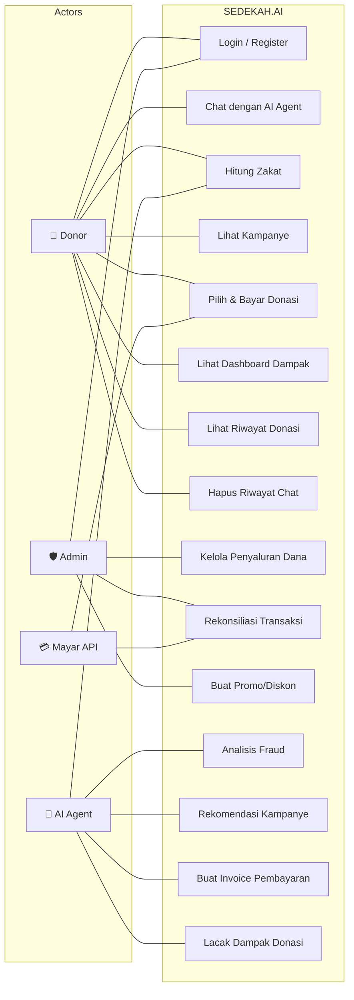
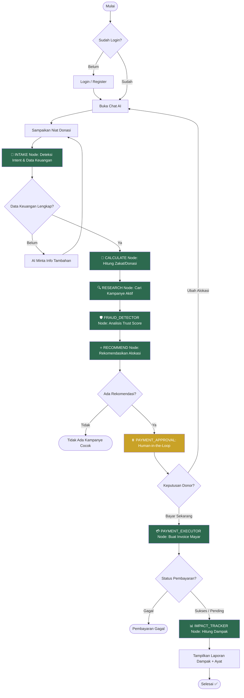
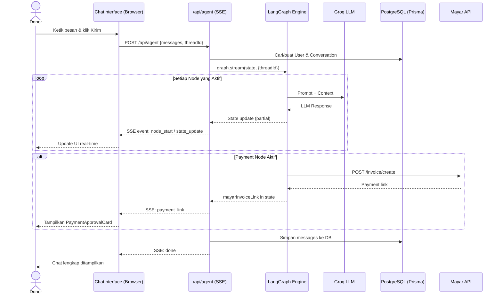
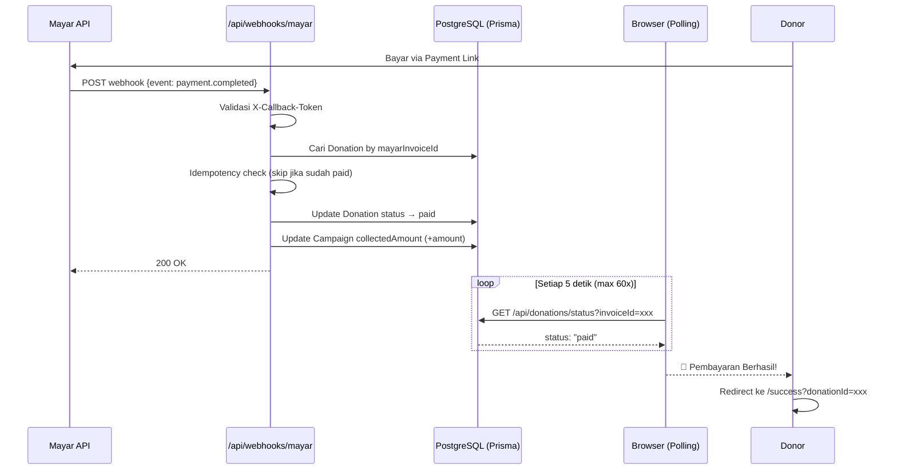
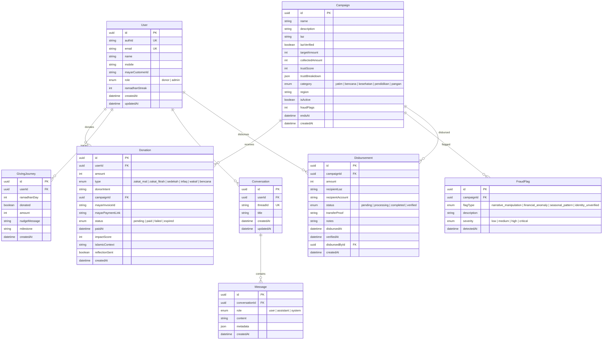
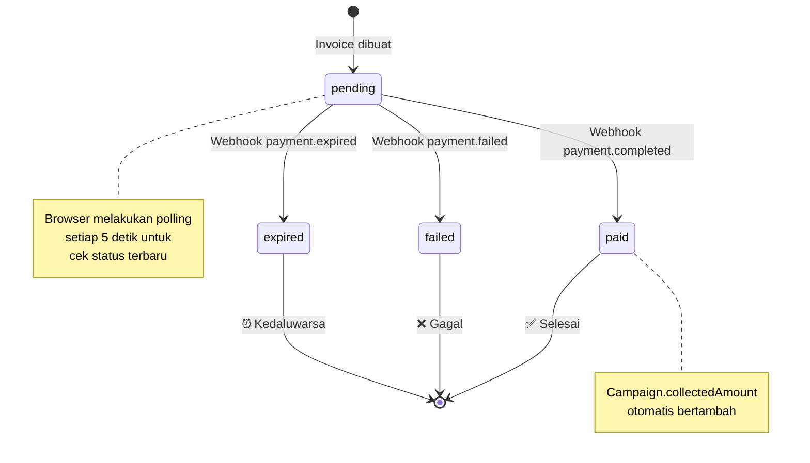
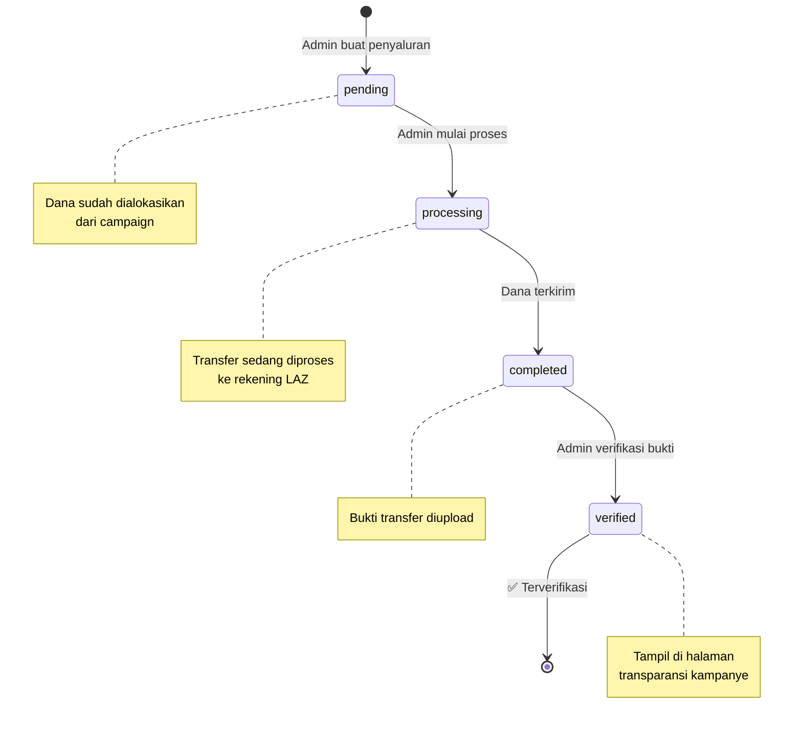
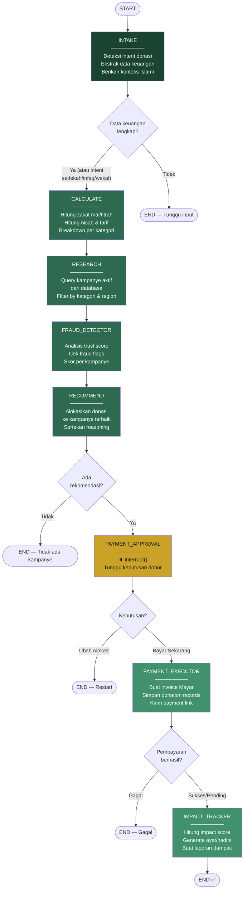
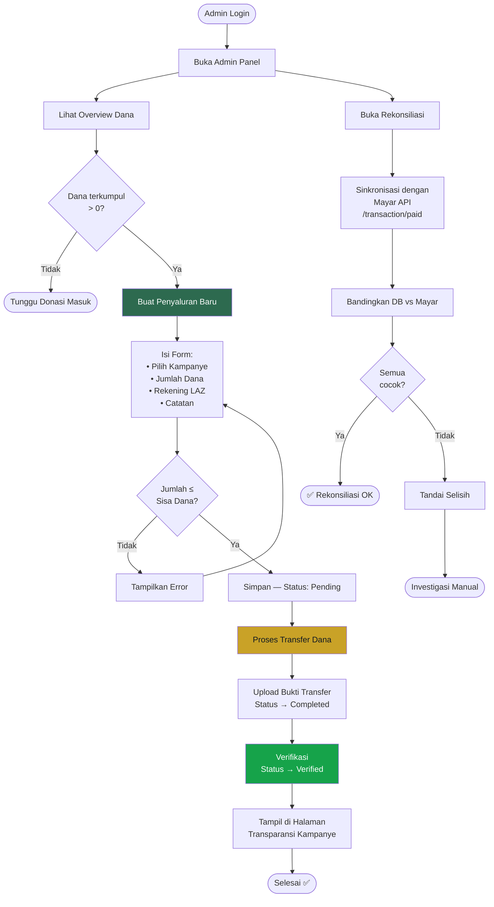
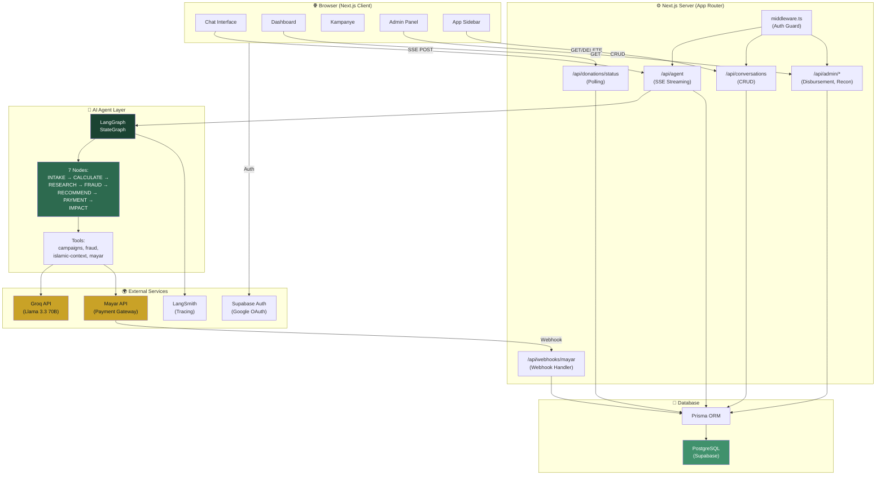

# SEDEKAH.AI — Diagram Arsitektur & Alur Kerja

> Dokumentasi visual proyek SEDEKAH.AI menggunakan Mermaid diagram.
> Gunakan preview Mermaid di VS Code atau GitHub untuk melihat diagram.

---

## Daftar Isi

1. [Use Case Diagram](#1-use-case-diagram)
2. [Activity Diagram — Alur Donasi End-to-End](#2-activity-diagram--alur-donasi-end-to-end)
3. [Sequence Diagram — Chat SSE Streaming](#3-sequence-diagram--chat-sse-streaming)
4. [Sequence Diagram — Payment Webhook](#4-sequence-diagram--payment-webhook)
5. [Entity Relationship Diagram (ERD)](#5-entity-relationship-diagram-erd)
6. [State Diagram — Status Pembayaran](#6-state-diagram--status-pembayaran)
7. [State Diagram — Status Penyaluran Dana](#7-state-diagram--status-penyaluran-dana)
8. [Flowchart — LangGraph Agent Pipeline](#8-flowchart--langgraph-agent-pipeline)
9. [Flowchart — Admin Fund Disbursement](#9-flowchart--admin-fund-disbursement)
10. [Architecture Diagram — System Overview](#10-architecture-diagram--system-overview)

---

## 1. Use Case Diagram

Aktor utama dan interaksi mereka dengan sistem.

---

## 2. Activity Diagram — Alur Donasi End-to-End

Alur lengkap dari niat donatur hingga dampak terlapor.

---

## 3. Sequence Diagram — Chat SSE Streaming

Alur request/response saat pengguna mengirim pesan di chat.

---

## 4. Sequence Diagram — Payment Webhook

Alur ketika Mayar mengirim notifikasi pembayaran berhasil.

---

## 5. Entity Relationship Diagram (ERD)

Model database lengkap dengan relasi.

---

## 6. State Diagram — Status Pembayaran

Siklus hidup status donasi/pembayaran.

---

## 7. State Diagram — Status Penyaluran Dana

Siklus hidup penyaluran dana oleh admin.

---

## 8. Flowchart — LangGraph Agent Pipeline

Alur detail 7 node AI agent dengan routing kondisional.

---

## 9. Flowchart — Admin Fund Disbursement

Alur admin mengelola penyaluran dana kampanye.

---

## 10. Architecture Diagram — System Overview

Arsitektur tingkat tinggi seluruh sistem.

---

## Catatan

- Semua diagram menggunakan format **Mermaid** — didukung langsung oleh GitHub, GitLab, dan VS Code (dengan extension Mermaid).
- Warna mengikuti brand tokens SEDEKAH.AI (green: `#1B4332` → `#D8F3DC`, gold: `#C9A227`).
- Untuk melihat diagram, gunakan:
  - **VS Code:** Install extension "Markdown Preview Mermaid Support"
  - **GitHub:** Preview otomatis di file `.md`
  - **Online:** [Mermaid Live Editor](https://mermaid.live)
